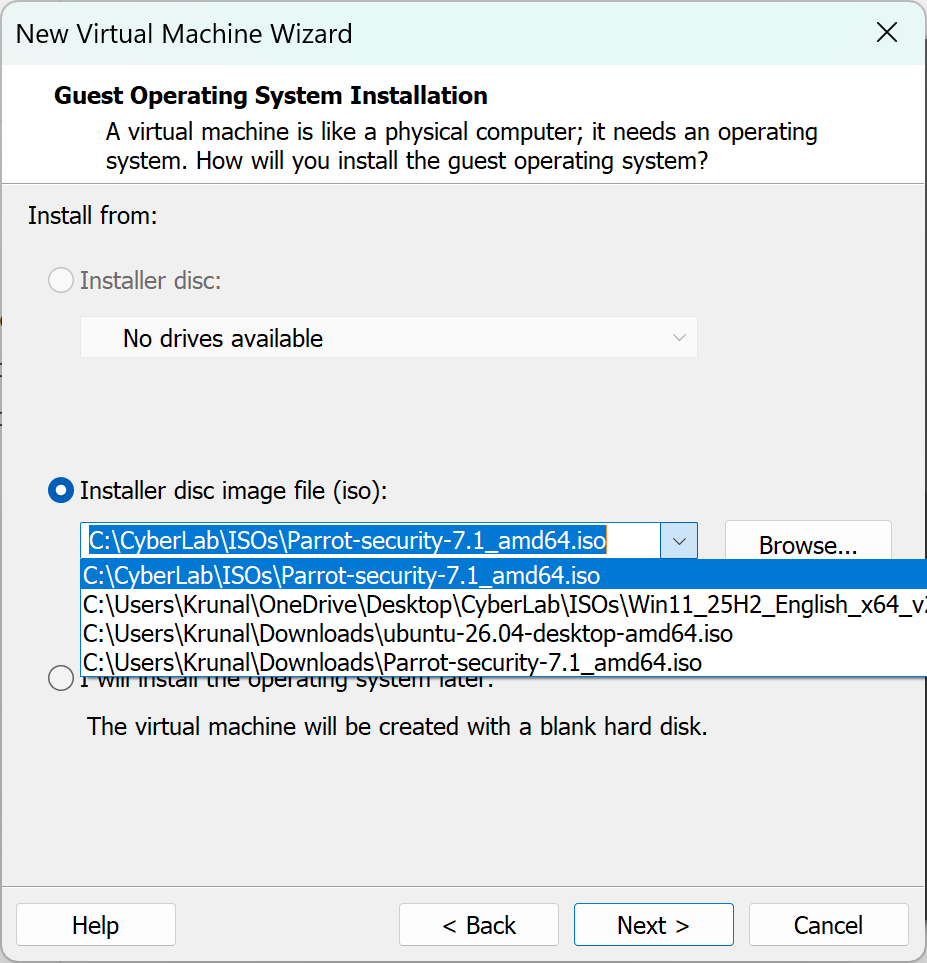
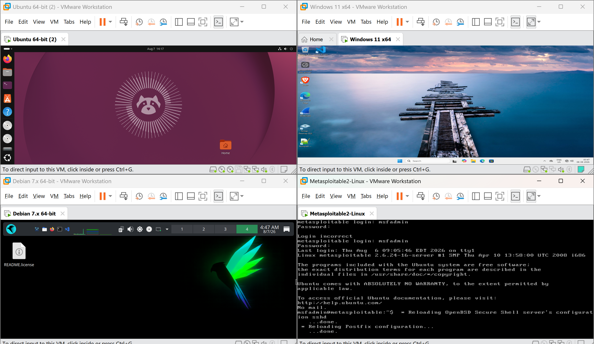
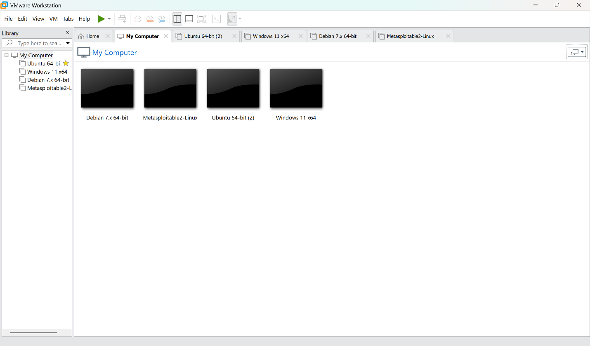
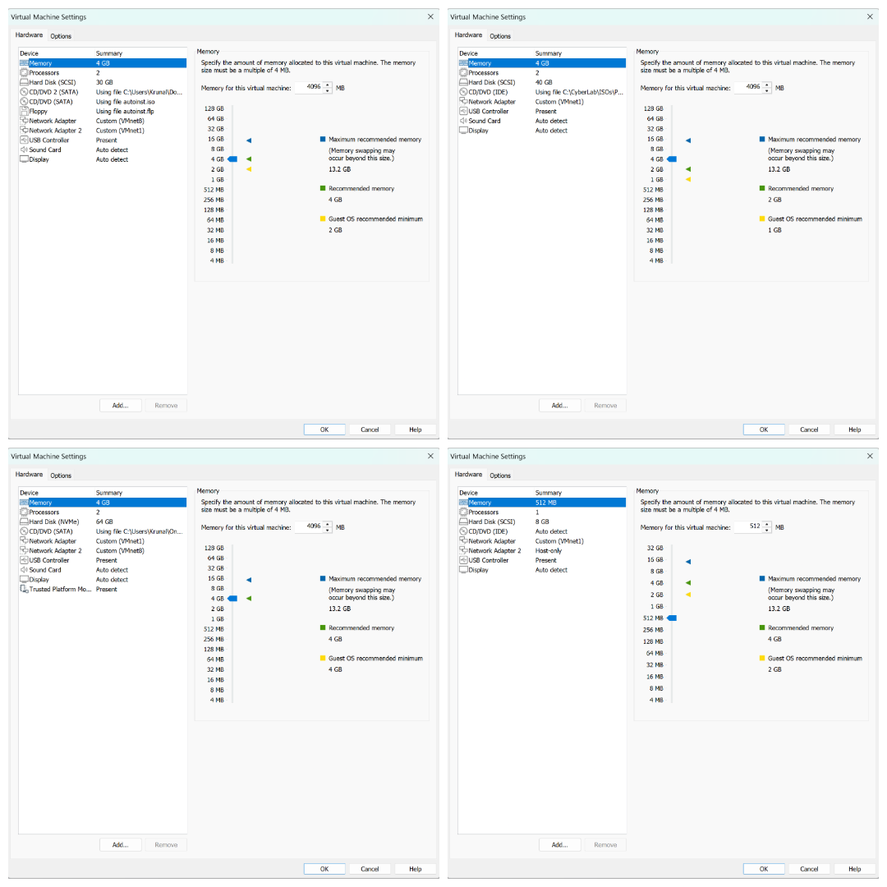

# Setting Up a Virtual Cybersecurity Lab Using VMware Workstation

## Aim
To create a virtualized networking environment using VMware Workstation for performing networking and cybersecurity experiments with multiple operating systems.

## Objectives
- Install and configure VMware Workstation.
- Create multiple virtual machines.
- Configure virtual hardware for each machine.
- Prepare a secure lab environment for networking and cybersecurity practicals.

## Software Requirements
- VMware Workstation
- Ubuntu Server
- Windows 11
- Parrot Security OS
- Metasploitable 2
- ISO installation files for all operating systems

## Virtual Machines

| Virtual Machine | Purpose |
|---|---|
| Ubuntu Server | Central server for network services such as SSH, HTTP, and DHCP |
| Windows 11 | Client machine for accessing server resources |
| Parrot Security OS | Security testing and penetration testing machine |
| Metasploitable 2 | Vulnerable machine for cybersecurity practice |

## Procedure
1. Installed VMware Workstation on the host computer.
2. Downloaded the required operating system ISO files.
3. Created four virtual machines:
   - Ubuntu Server
   - Windows 11
   - Parrot Security OS
   - Metasploitable 2
4. Allocated appropriate virtual hardware (CPU, RAM, storage) for each VM.
5. Installed the operating systems on their respective virtual machines.
6. Verified that all virtual machines booted successfully.
7. Added two network adapters to the Ubuntu Server:
   - Adapter 1: NAT Network
   - Adapter 2: Local Network
8. Added one Local Network adapter to Windows 11, Parrot OS, and Metasploitable 2.

## Observations
- All four VMs installed cleanly and booted without errors on first attempt.
- Ubuntu Server was configured as the only dual-homed machine (NAT + Local), positioning it as the gateway for the rest of the lab.
- Hardware allocation (CPU/RAM/storage) was kept modest per VM to allow all four to run concurrently on the host.

## Result
The VMware virtual lab environment was successfully created. All four virtual machines were installed, configured, and ready for networking experiments.

### Evidence

*Figure 1.1 – ISO files of virtual machines*

*Figure 1.2 – All four VMs running simultaneously in VMware Workstation*

*Figure 1.3 – VMware Workstation home screen showing all four VMs*

*Figure 1.4 – Virtual machine hardware settings*
