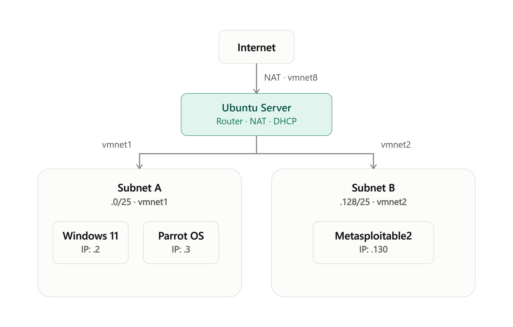
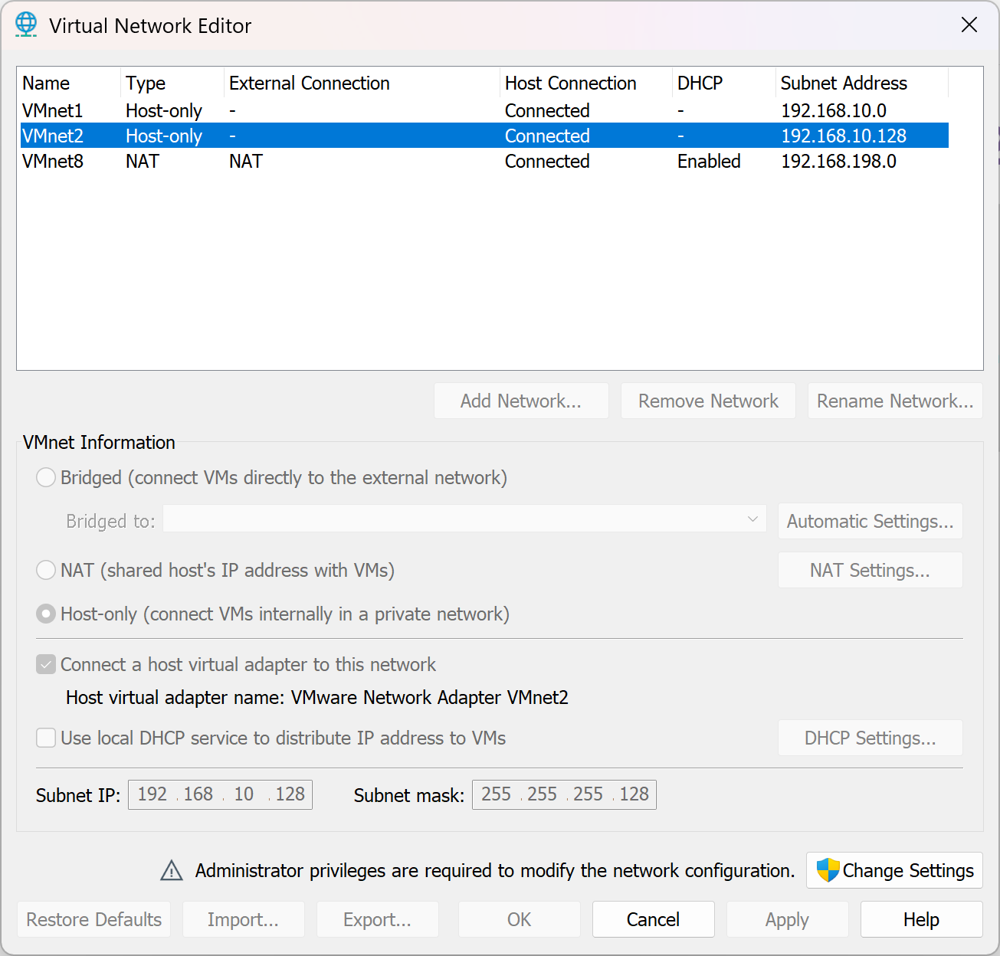
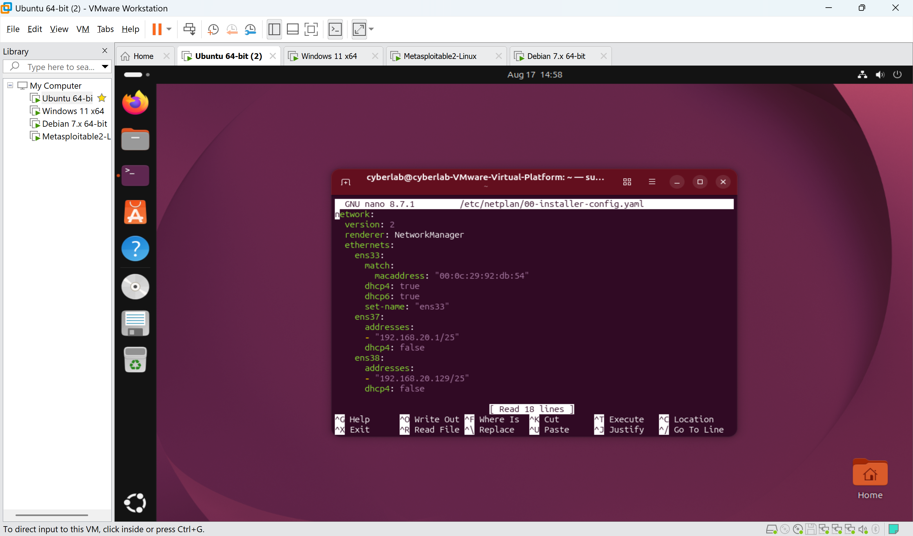
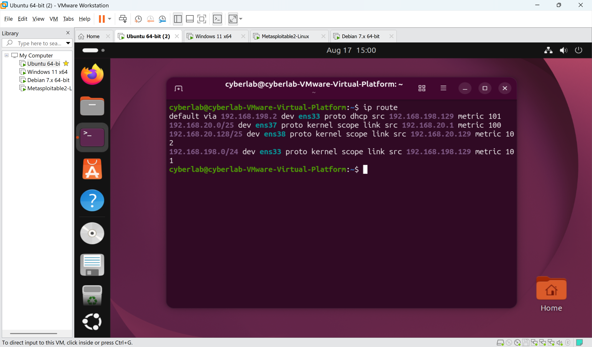
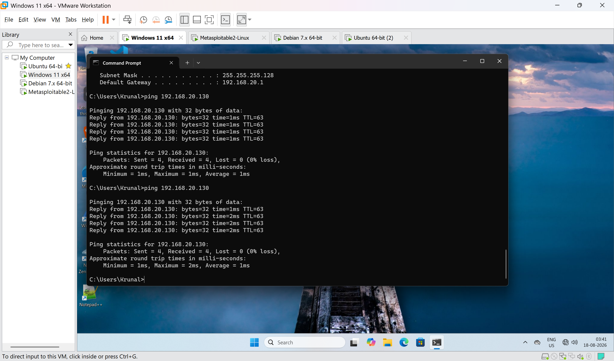
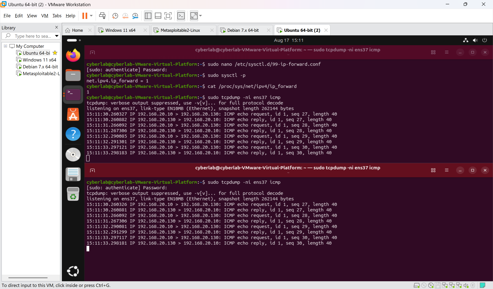
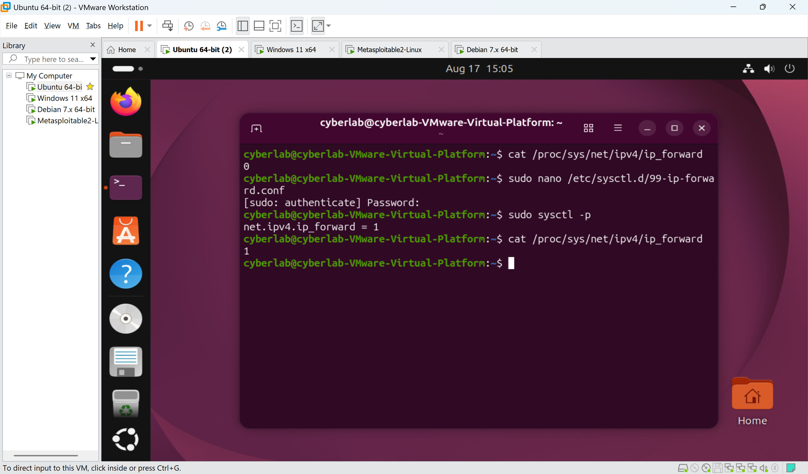
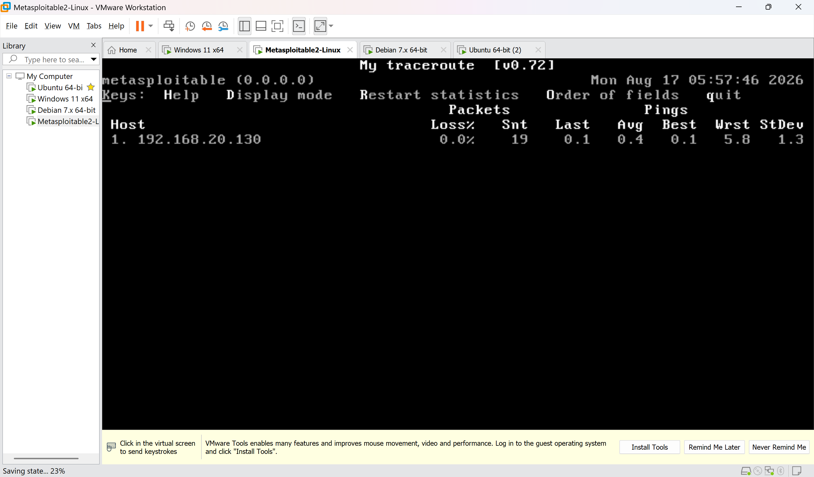

# Subnetting and Inter-Subnet Routing via Ubuntu Server

## Aim
To divide the internal lab network into two separate subnets and configure Ubuntu Server as a router to enable communication between them, moving beyond a single flat internal network.

## Objectives
- Manually calculate two subnets from the original network range.
- Add a second host-only virtual network (vmnet2) in VMware.
- Configure Ubuntu Server as a router between the two subnets using static IP addressing and netplan.
- Enable and correctly persist IP forwarding on Ubuntu.
- Verify routing using ping and traceroute, and confirm the network behaves as designed.

## Software / Network Requirements
- VMware Workstation
- Ubuntu Server (router)
- Windows 11 and Parrot OS (Subnet A)
- Metasploitable2 (Subnet B)
- A second host-only virtual network, vmnet2, created via VMware's Virtual Network Editor (in addition to the existing vmnet1 and vmnet8)

## Subnetting Plan

The original internal network `192.168.10.0/24` was split into two `/25` subnets by borrowing one host bit:

| Subnet | Network Address | Subnet Mask | Usable Range | Broadcast |
|---|---|---|---|---|
| Subnet A | 192.168.10.0/25 | 255.255.255.128 | .1 – .126 | .127 |
| Subnet B | 192.168.10.128/25 | 255.255.255.128 | .129 – .254 | .255 |

## Network Configuration

### Ubuntu Server (Router)
| Interface | Network | IP Address | Purpose |
|---|---|---|---|
| ens33 | NAT (vmnet8) | DHCP | Internet connectivity |
| ens37 | Subnet A (vmnet1) | 192.168.10.1/25 | Gateway for Subnet A |
| ens38 | Subnet B (vmnet2) | 192.168.10.129/25 | Gateway for Subnet B |

### Subnet A — Windows 11 and Parrot OS
| Machine | IP Address | Gateway |
|---|---|---|
| Windows 11 | 192.168.10.2/25 | 192.168.10.1 |
| Parrot OS | 192.168.10.3/25 | 192.168.10.1 |

### Subnet B — Metasploitable2
| Machine | IP Address | Gateway |
|---|---|---|
| Metasploitable2 | 192.168.10.130/25 | 192.168.10.129 |

## Procedure
1. Calculated the two `/25` subnets manually from the original `192.168.10.0/24` range.
2. Created a second host-only network, **vmnet2**, in VMware's Virtual Network Editor, with DHCP disabled.
3. Added a third network adapter to Ubuntu Server and connected it to vmnet2.
4. Kept Windows 11 and Parrot OS on vmnet1 (Subnet A); moved Metasploitable2 to vmnet2 (Subnet B).
5. Assigned static IP addresses to all machines using netplan (Ubuntu) and each guest OS's own network settings.
6. Set each guest machine's default gateway to Ubuntu's matching subnet interface.
7. Enabled IP forwarding on Ubuntu.
8. Verified connectivity and routing using `ping` and `traceroute` between Subnet A and Subnet B.

## Commands Used

**netplan configuration (Ubuntu)**
```yaml
network:
  version: 2
  ethernets:
    ens33:
      dhcp4: true
    ens37:
      addresses:
        - 192.168.10.1/25
      dhcp4: false
    ens38:
      addresses:
        - 192.168.10.129/25
      dhcp4: false
```
```
sudo netplan apply
```

**Enabling and persisting IP forwarding**
```
sudo sysctl -w net.ipv4.ip_forward=1
sudo nano /etc/sysctl.d/99-ip-forward.conf
    net.ipv4.ip_forward = 1
sudo sysctl --system
cat /proc/sys/net/ipv4/ip_forward
```

**Verification**
```
ip route
ping 192.168.10.130      # from Parrot (Subnet A) to Metasploitable (Subnet B)
ping 192.168.10.2        # from Metasploitable (Subnet B) to Windows (Subnet A)
traceroute 192.168.10.130
```

**Investigating an ICMP traceroute anomaly**
```
traceroute -I 192.168.10.130
cat /proc/sys/net/ipv4/icmp_ratelimit
sudo sysctl -w net.ipv4.icmp_ratelimit=0
sudo tcpdump -ni ens38 icmp
sudo tcpdump -ni ens37 icmp
sudo mtr -I 192.168.10.130
```

## Observations
- `ip route` on Ubuntu showed exactly one `default` route (via ens33) and two `scope link` connected routes, one per subnet interface (ens37, ens38) — confirming no conflicting default routes existed.
- Standard UDP-based `traceroute` correctly showed a 2-hop path (Ubuntu, then Metasploitable) between Subnet A and Subnet B, confirming Ubuntu as the sole routing point.
- ICMP-based `traceroute -I` intermittently showed loss on intermediate TTLs despite there being only two real hops. This was investigated and ruled out as a rate-limiting issue (`icmp_ratelimit` set to 0, issue persisted). Running `mtr -I`, which paces probes more slowly, showed 0% packet loss — indicating the original loss was caused by burst-probe timing on the virtual NIC path rather than a genuine routing or firewall fault. UDP traceroute was treated as the authoritative result for this reason.

## Troubleshooting: Metasploitable Could Ping Out, But Not Be Pinged

**Issue:** After enabling IP forwarding, Windows and Parrot could successfully ping Metasploitable2, but Metasploitable2 could not ping Windows or Parrot back — a one-directional failure across the same routed path.

**Diagnosis steps:**
1. Confirmed Metasploitable2's gateway (`192.168.10.129`) and subnet mask (`255.255.255.128`) were both correctly configured — ruled out.
2. Checked `ufw status` on Ubuntu — inactive, ruled out as the direct cause.
3. Checked `net.ipv4.ip_forward` directly with `cat /proc/sys/net/ipv4/ip_forward` and found it had reverted to `0` after a reboot, despite being set earlier in the session.
4. Used `tcpdump` on both `ens37` and `ens38` simultaneously while pinging from Metasploitable, confirming ICMP echo requests were reaching and leaving Ubuntu correctly once forwarding was re-enabled live — isolating the fault specifically to forwarding not being persisted across reboots.

**Root cause:** The `net.ipv4.ip_forward=1` setting had only been applied live with `sysctl -w`, and was not correctly persisted, so it silently reverted to `0` after the VM was rebooted.

**Fix:** Created a dedicated config file at `/etc/sysctl.d/99-ip-forward.conf` containing `net.ipv4.ip_forward = 1`, applied with `sudo sysctl --system`, and confirmed the value survived a full reboot before retesting.

**Verification:** After the fix, `cat /proc/sys/net/ipv4/ip_forward` returned `1` after reboot, and Metasploitable2 could successfully ping both Windows and Parrot in both directions.

## Result
The internal lab network was successfully divided into two `/25` subnets, with Ubuntu Server configured and verified as the routing point between them. IP forwarding was enabled, correctly persisted across reboots, and validated using `ping` and `traceroute`. A real-world routing/persistence issue was encountered, diagnosed methodically using `tcpdump`, and resolved — confirming a solid understanding of both static subnetting and Linux routing fundamentals.

### Evidence

*(Screenshots to be added)*


*Figure 3.1 – Subnet calculation / addressing plan*


*Figure 3.2 – vmnet2 created in Virtual Network Editor*


*Figure 3.3 – Ubuntu netplan configuration file*


*Figure 3.4 – `ip route` output showing default and connected routes*


*Figure 3.5 – Successful ping from Parrot (Subnet A) to Metasploitable (Subnet B)*


*Figure 3.6 – UDP-based traceroute showing correct 2-hop path*


*Figure 3.7 – `ip_forward` value showing 0 after reboot, before the fix*


*Figure 3.8 – tcpdump on ens37 and ens38 confirming ICMP forwarding*


*Figure 3.9 – `ip_forward` value showing 1 after reboot, confirming the fix*


*Figure 3.10 – `mtr -I` result showing 0% packet loss, confirming the path is clean*
