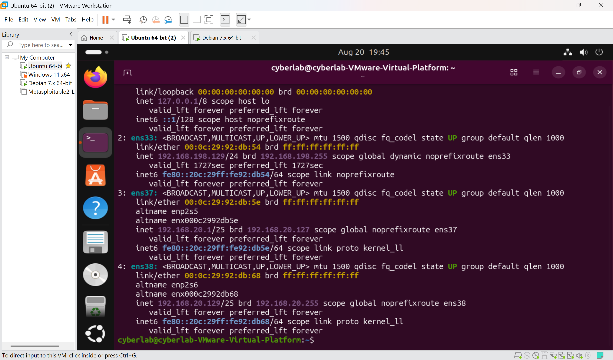
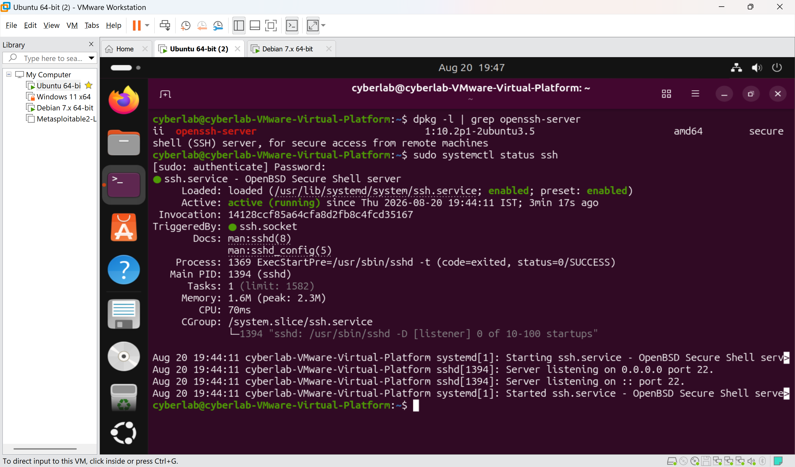
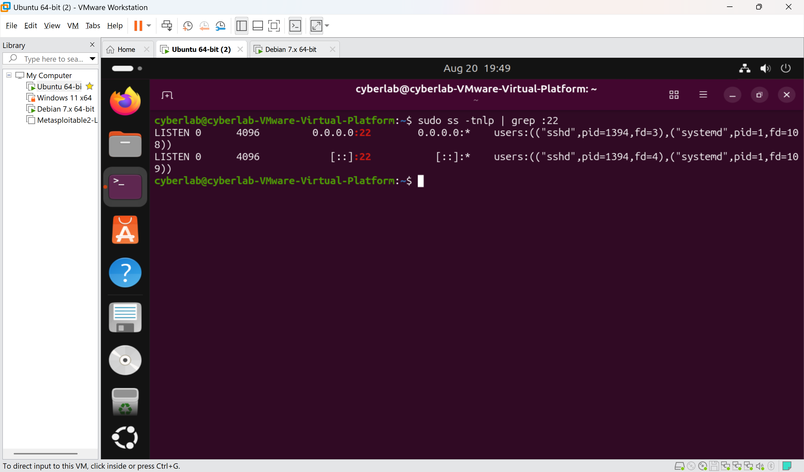
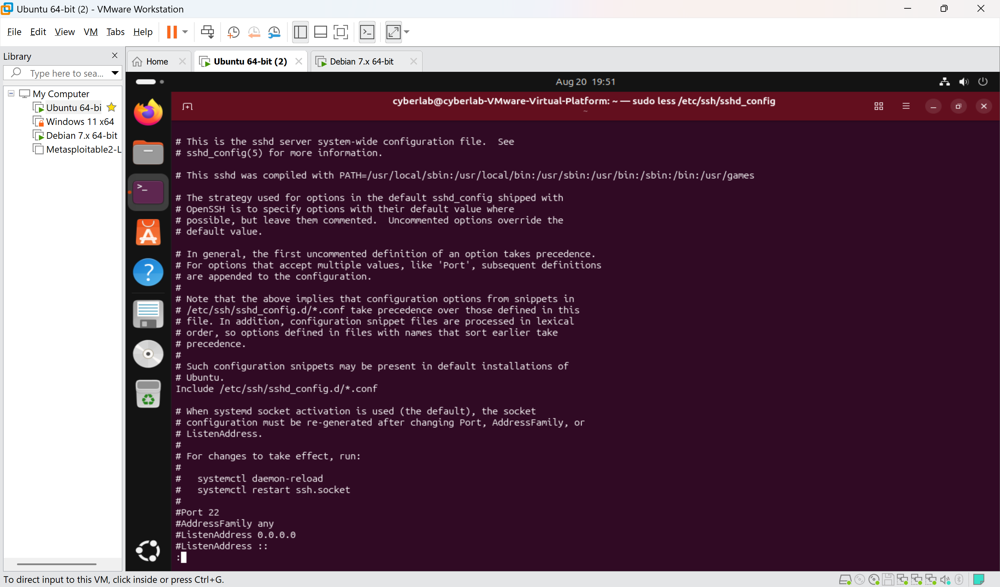
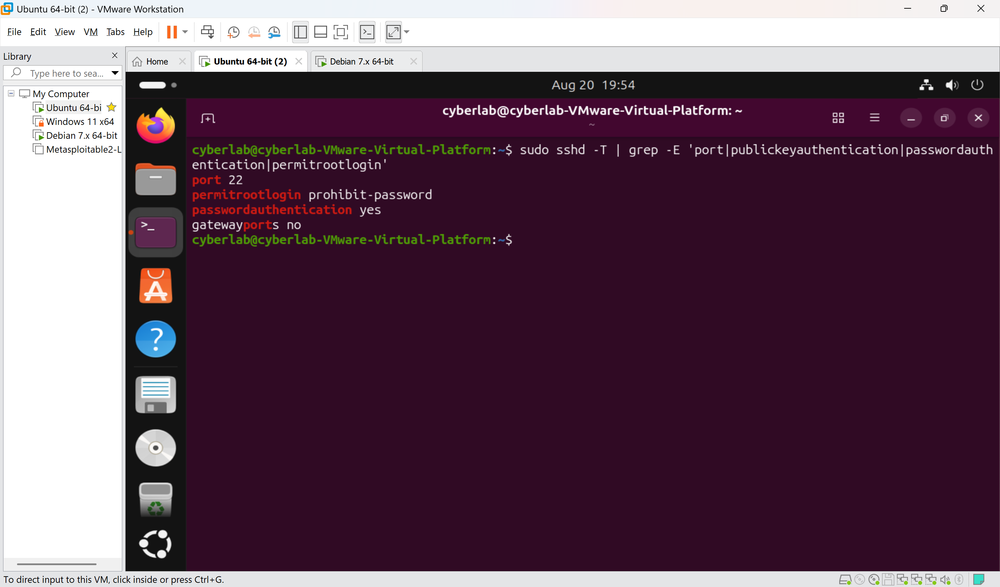
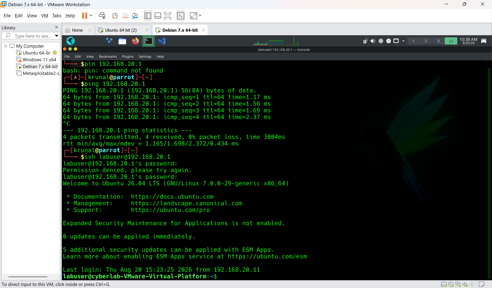
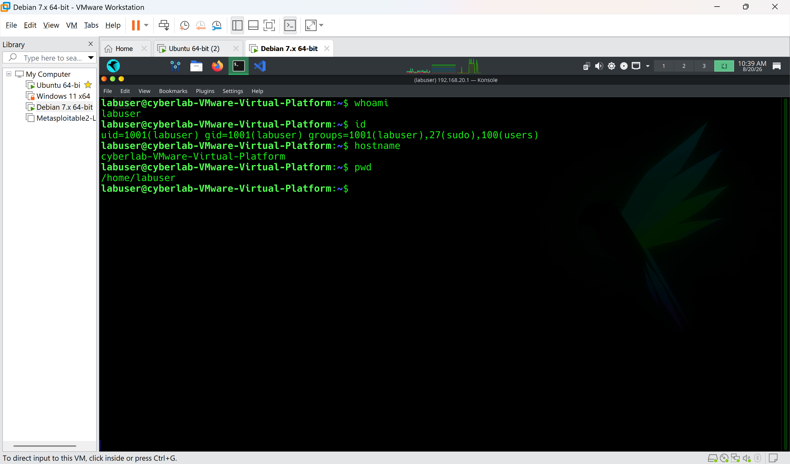
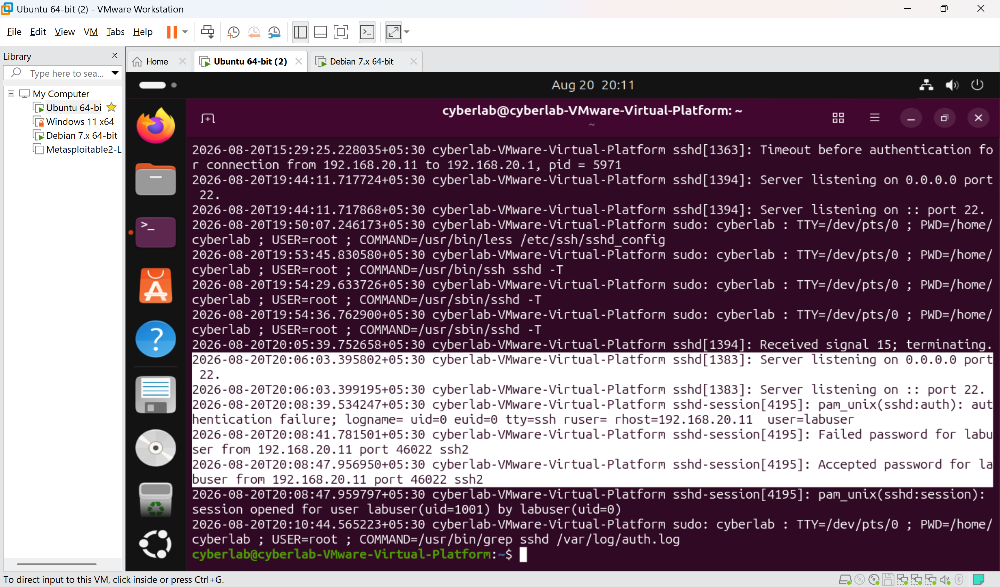
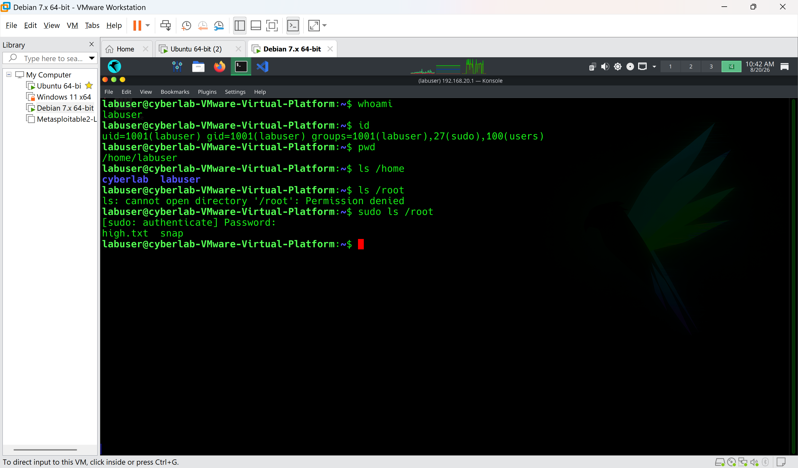
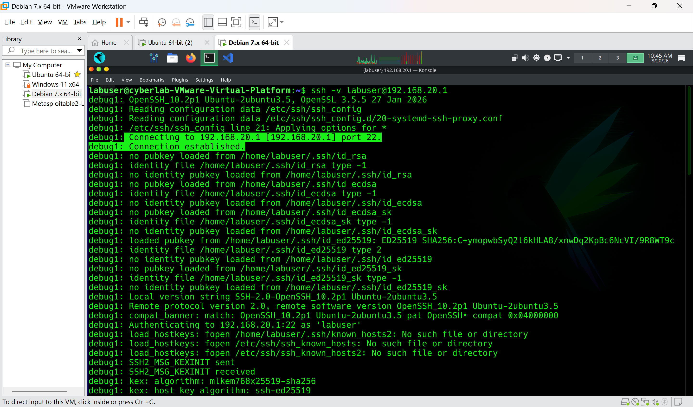

# Lab 05 — SSH Fundamentals & Password Authentication

## Aim

To understand and configure SSH (Secure Shell) on Ubuntu Server, establish a secure remote connection from Parrot OS, understand SSH authentication and authorization, inspect SSH configuration, and analyze SSH authentication logs.

## Objectives

* Understand SSH and its purpose.
* Understand SSH client and server architecture.
* Identify the default SSH port.
* Install and verify the OpenSSH server.
* Manage the SSH service using `systemctl`.
* Identify the SSH server configuration file.
* Establish an SSH connection using password authentication.
* Understand authentication vs authorization.
* Verify the identity and privileges of an SSH user.
* Examine SSH authentication logs.
* Understand the relationship between SSH, Linux permissions, `sudo`, and root.
* Use SSH verbose mode for troubleshooting.

## Software Requirements

* VMware Workstation
* Ubuntu Server (SSH server)
* Parrot OS (SSH client)
* Terminal
* `labuser` Linux account (created in Lab 04)

## Lab Environment

|Machine|Role|
|-|-|
|Parrot OS|SSH Client|
|Ubuntu Server|SSH Server|
|`labuser`|User account used for SSH authentication|

The existing VMware local network (set up in the home lab) is used for communication between Parrot OS and Ubuntu Server.

```text
Parrot OS
SSH Client
    │
    │ SSH connection
    │ TCP/22
    ↓
Ubuntu Server
SSH Server
    │
    ↓
labuser
```

## Prerequisites

The following concepts from Lab 04 — Linux Users, Permissions & File Structure should already be understood:

* Linux users and groups
* Root user
* `sudo`
* File ownership
* File permissions
* `/home`, `/root`, `/etc`, `/var/log`
* Authentication, Authorization and Accounting (AAA)

## Procedure

### 1. Identify Ubuntu Server IP Address

On Ubuntu Server:

```bash
ip addr
```

Identified the IP address of the interface connected to the VMware local network.

From Parrot OS, connectivity was verified:

```bash
ping <UBUNTU_IP>
```

---

### 2. Check OpenSSH Server Installation

Checked whether the OpenSSH server package is installed:

```bash
dpkg -l | grep openssh-server
```

Also checked whether the SSH server executable exists:

```bash
which sshd
```

If OpenSSH Server was not installed:

```bash
sudo apt update
sudo apt install openssh-server
```

---

### 3. Check SSH Service Status

Checked the SSH service:

```bash
sudo systemctl status ssh
```

Verified whether the service is active:

```bash
sudo systemctl is-active ssh
```

Checked whether it is configured to start automatically at boot:

```bash
sudo systemctl is-enabled ssh
```

Other important commands:

```bash
sudo systemctl start ssh
sudo systemctl stop ssh
sudo systemctl restart ssh
```

The SSH service must be running before Ubuntu Server can accept incoming SSH connections.

---

### 4. Check SSH Listening Port

SSH normally listens on TCP port 22.

Checked the listening socket:

```bash
sudo ss -tlnp | grep :22
```

```text
SSH Server
    ↓
   TCP
    ↓
 Port 22
    ↓
Incoming SSH connections
```

A listening SSH service showed port 22 bound and ready for incoming connections.

---

### 5. Examine SSH Server Configuration

The primary SSH server configuration file is:

```text
/etc/ssh/sshd_config
```

Viewed the configuration:

```bash
sudo less /etc/ssh/sshd_config
```

The configuration was not modified during this task — only inspected.

```text
/etc/ssh/sshd_config  -> SSH configuration
/usr/sbin/sshd        -> SSH server program
/var/log/auth.log     -> Authentication/security events
```

---

### 6. View Effective SSH Configuration

Rather than only reading the static configuration file, the *effective* configuration currently applied by the running server was displayed:

```bash
sudo sshd -T
```

Filtered for the key authentication-related settings:

```bash
sudo sshd -T | grep -E 'port|pubkeyauthentication|passwordauthentication|permitrootlogin'
```

This confirmed the actual settings in force (listening port, whether password authentication is enabled, and whether root login is permitted), which can differ from what a quick read of the config file might suggest if defaults or included files are in play.

---

### 7. Establish SSH Password Authentication

From Parrot OS:

```bash
ssh labuser@<UBUNTU_IP>
```

Example:

```bash
ssh labuser@192.168.20.10
```

Entered the password for `labuser`.

After successful authentication, verified the account inside the session:

```bash
whoami
id
hostname
pwd
```

---

## Understanding What Happened During SSH Login

```text
Parrot OS
   │
   │ SSH connection
   ↓
Ubuntu SSH Server
   │
   │ Authentication
   ↓
labuser
   │
   ↓
Remote Shell
```

### Authentication

Authentication answers:

> Who are you?

```text
User               -> labuser
Authentication method -> password
```

### Authorization

Authorization answers:

> What is this user allowed to do?

After authentication, `labuser` is still subject to normal Linux:

* User permissions
* Group permissions
* File ownership
* `sudo` policy

Therefore:

```text
Successful SSH login
        ≠
Full system access
```

---

### 8. Verify User Privileges

Inside the SSH session:

```bash
whoami
id
groups
```

Attempted to access the root user's home directory:

```bash
ls /root
```

As a normal user, access was denied.

Then, since `labuser` has `sudo` authorization (granted in Lab 04):

```bash
sudo ls /root
```

This succeeded, demonstrating the distinction between:

```text
labuser
   ↓
Normal Linux permissions
```

and:

```text
labuser
   ↓
sudo authorization
   ↓
Elevated privileges
```

---

### 9. Examine SSH Authentication Logs

Ubuntu records authentication-related activity in:

```text
/var/log/auth.log
```

Searched for SSH events:

```bash
sudo grep sshd /var/log/auth.log | tail -20
```

Or viewed the latest entries:

```bash
sudo tail -n 30 /var/log/auth.log
```

Located the SSH login that had just been performed from Parrot OS. Relevant information present in the log included:

* Authentication attempts
* Username
* Source address
* Successful authentication
* Failed authentication
* SSH session activity

---

### 10. SSH Verbose Mode

SSH provides verbose output useful for troubleshooting.

From Parrot OS:

```bash
ssh -v labuser@<UBUNTU_IP>
```

For additional detail:

```bash
ssh -vv labuser@<UBUNTU_IP>
```

For maximum debugging information:

```bash
ssh -vvv labuser@<UBUNTU_IP>
```

Observed the connection and authentication process, specifically:

* Connection establishment
* SSH protocol negotiation
* Authentication methods offered/attempted
* Authentication success/failure
* Session establishment

---

## SSH Architecture

```text
                 PARROT OS
                SSH CLIENT
                     │
                     │ TCP/22
                     ↓
              UBUNTU SERVER
               SSH SERVER
                     │
              Authentication
                     │
                     ↓
                  labuser
                     │
            ┌────────┴────────┐
            ↓                 ↓
      Normal Access          sudo
            │                 │
            ↓                 ↓
      Linux Permissions    Elevated Access
```

## Linux Filesystem and SSH

Lab 05 also demonstrates how the filesystem concepts from Lab 04 are used by a real service:

```text
/etc/ssh/         -> SSH configuration
/usr/sbin/sshd    -> SSH server program
/home/labuser/    -> User's home directory
/root/            -> Root user's home directory
/var/log/auth.log -> Authentication and security events
```

This reinforces the idea that an installed service is not necessarily represented by a single file in a single directory.

## Observations

* SSH provides secure remote access to Linux systems.
* The SSH server runs as a system service and must be active to accept connections.
* SSH normally uses TCP port 22.
* SSH server configuration is stored under `/etc/ssh/`, specifically `sshd_config`.
* `sudo sshd -T` shows the effective configuration actually applied by the running server, which is more reliable than reading the config file alone.
* Successful SSH authentication does not automatically give the user root privileges.
* Linux permissions and `sudo` determine what an authenticated user can actually do — authentication and authorization are separate concerns.
* SSH authentication events are recorded in `/var/log/auth.log`, including source address, username, and success/failure.
* SSH verbose mode (`-v`, `-vv`, `-vvv`) is a useful tool for diagnosing connection and authentication problems.
* SSH ties together networking, operating-system security, authentication, and authorization in a single service.

## Security Concepts

### Authentication, Authorization and Accounting (AAA)

**Authentication:** Who are you?

```text
labuser + password
```

**Authorization:** What are you allowed to do?

```text
Linux permissions
Groups
sudo policy
```

**Accounting:** What happened?

```text
/var/log/auth.log
```

```text
Authentication
       ↓
Authorization
       ↓
Accounting
```

### Penetration Tester Perspective

A penetration tester may investigate an SSH service to determine:

```text
Is SSH exposed?
        ↓
Which port?
        ↓
Which SSH version?
        ↓
Which authentication methods?
        ↓
Which users are authorized?
        ↓
Is root login permitted?
        ↓
Are there insecure configurations?
```

All testing must be performed only against systems that are explicitly authorized and within the defined scope.

### SOC Analyst Perspective

A SOC analyst may investigate SSH activity by examining:

```text
SSH Login
    ↓
Authentication Log
    ↓
Source IP
    ↓
Username
    ↓
Success / Failure
    ↓
Subsequent Activity
```

For example:

```text
Unknown IP
    ↓
Multiple failed SSH logins
    ↓
Successful login
    ↓
sudo activity
    ↓
Suspicious commands
```

This pattern could become an incident requiring further investigation.

## Result

The SSH server was successfully configured and verified on Ubuntu Server. A remote SSH connection was established from Parrot OS using the `labuser` account with password authentication. The SSH service status, listening port, server configuration, effective configuration, user authorization, authentication logs, and verbose connection process were all examined and practically verified.

```text
Network Connectivity
        ↓
SSH Service
        ↓
Authentication
        ↓
User Identity
        ↓
Authorization
        ↓
Linux Permissions / sudo
        ↓
Logging
```

This lab establishes the foundation for **Lab 06 — SSH Key-Based Authentication & Security**, where public/private key authentication, `authorized_keys`, `known_hosts`, SSH key permissions, and SSH hardening will be implemented.

## Commands Used

### Connectivity

```bash
ip addr
ping <UBUNTU_IP>
```

### Installation

```bash
dpkg -l | grep openssh-server
which sshd
sudo apt update
sudo apt install openssh-server
```

### Service Management

```bash
sudo systemctl status ssh
sudo systemctl is-active ssh
sudo systemctl is-enabled ssh
sudo systemctl start ssh
sudo systemctl stop ssh
sudo systemctl restart ssh
```

### Port and Configuration

```bash
sudo ss -tlnp | grep :22
sudo less /etc/ssh/sshd_config
sudo sshd -T
sudo sshd -T | grep -E 'port|pubkeyauthentication|passwordauthentication|permitrootlogin'
```

### Connection and Identity

```bash
ssh labuser@<UBUNTU_IP>
whoami
id
hostname
pwd
groups
```

### Authorization Testing

```bash
ls /root
sudo ls /root
```

### Logs

```bash
sudo grep sshd /var/log/auth.log | tail -20
sudo tail -n 30 /var/log/auth.log
```

### Verbose Troubleshooting

```bash
ssh -v labuser@<UBUNTU_IP>
ssh -vv labuser@<UBUNTU_IP>
ssh -vvv labuser@<UBUNTU_IP>
```

## Evidence


*Figure 5.1 – Ubuntu Server IP address*


*Figure 5.2 – OpenSSH server installation and service status*


*Figure 5.3 – SSH listening on port 22*


*Figure 5.4 – SSH server configuration*


*Figure 5.5 – Effective SSH configuration*


*Figure 5.6 – SSH connection from Parrot OS*


*Figure 5.7 – Successful SSH login*


*Figure 5.8 – SSH authentication logs*


*Figure 5.9 – SSH authorization and sudo privileges*


*Figure 5.10 – SSH verbose connection*
