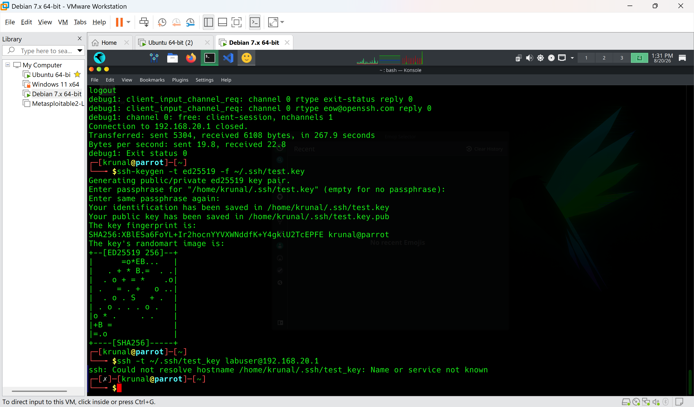
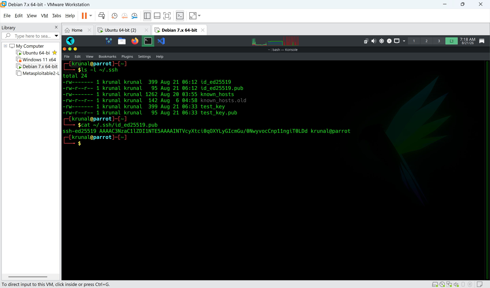
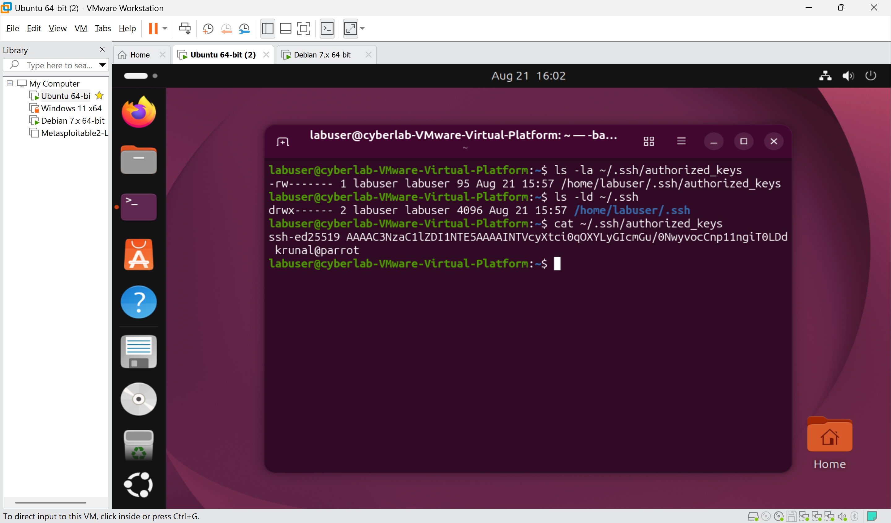
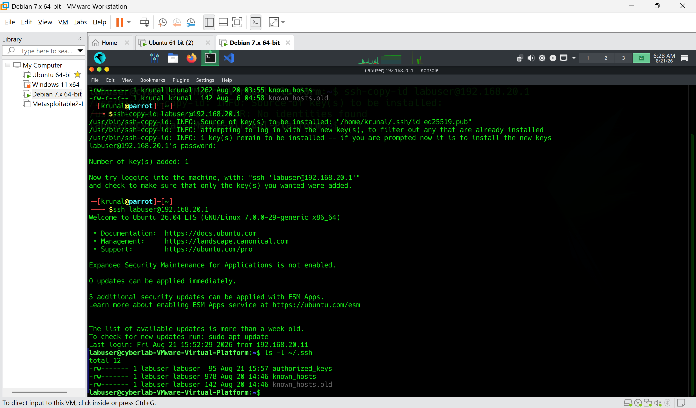
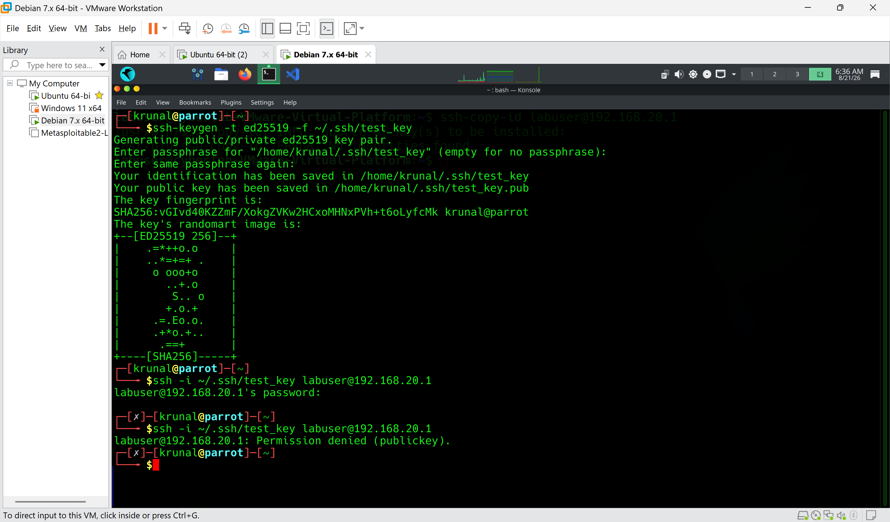
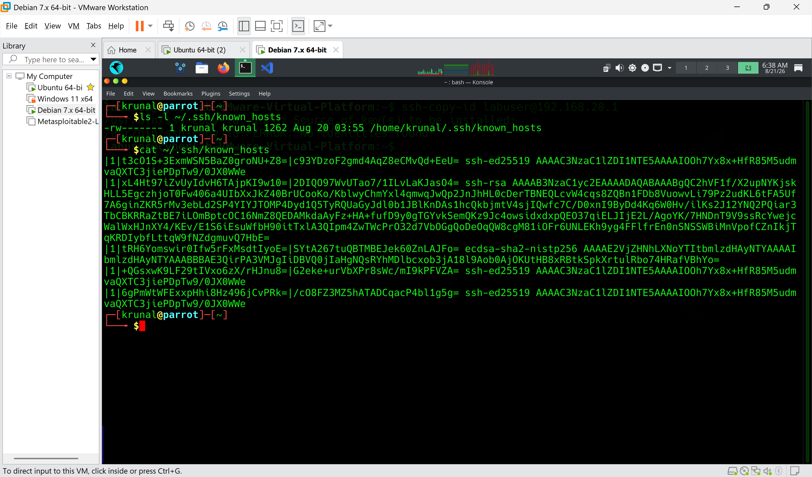
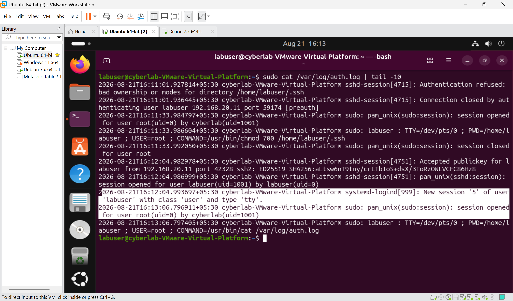

# Lab 06 — SSH Key-Based Authentication & Security

## Aim
To implement and understand SSH public-key authentication, including key generation, key permissions, `authorized_keys`, `known_hosts`, host verification, authentication failure scenarios, and basic SSH security hardening.

## Objectives
- Generate an SSH key pair and understand the distinction between public and private keys.
- Correctly set and understand file permissions for SSH keys and directories.
- Install a public key on the SSH server and authenticate using it instead of a password.
- Deliberately trigger and observe authentication failures (wrong key, incorrect permissions).
- Understand the role of `known_hosts` in verifying server identity.
- Correlate successful and failed authentication attempts with server-side logs.

## Software / Network Requirements
- Parrot OS — SSH client
- Ubuntu Server — SSH server (built in Lab 05), with `labuser` account (created in Lab 04)
- Static IP addressing already configured between Parrot and Ubuntu (Lab 03)

## Procedure

### 1. Generate SSH key pair (Parrot)
```
ssh-keygen -t ed25519
ls -l ~/.ssh/id_ed25519*
```
Generated a new ED25519 key pair on Parrot, stored under `~/.ssh/`.

*Screenshot: `01-key-generation.png`*

### 2. Understand public vs private key
```
ls -l ~/.ssh/
cat ~/.ssh/id_ed25519.pub
```
Viewed the public key contents directly. The private key (`id_ed25519`, no `.pub` extension) was **not** displayed, since it must never be shared or exposed.

*Screenshot: `02-public-private-key.png`*

### 3. Private key permissions
```
ls -l ~/.ssh/id_ed25519
chmod 600 ~/.ssh/id_ed25519
```
Confirmed the private key is restricted to owner read/write only (`600`) — SSH refuses to use a private key that other users could potentially read.

*Screenshot: `03-private-key-permissions.png`*

### 4. Install public key on the server
From Parrot:
```
ssh-copy-id labuser@<UBUNTU_IP>
```
On Ubuntu:
```
ls -la /home/labuser/.ssh
```
The public key was copied into `labuser`'s `authorized_keys` file on Ubuntu.

*Screenshot: `04-authorized-key-installed.png`*

### 5. Inspect authorized_keys and its permissions
On Ubuntu:
```
cat /home/labuser/.ssh/authorized_keys
ls -ld /home/labuser/.ssh
ls -l /home/labuser/.ssh/authorized_keys
```

**Target permissions:**
| Path | Required Permission |
|---|---|
| `.ssh` directory | 700 |
| `authorized_keys` file | 600 |

*Screenshot: `05-authorized-keys-permissions.png`*

### 6. Successful key-based authentication
From Parrot:
```
ssh -i ~/.ssh/id_ed25519 labuser@<UBUNTU_IP>
whoami
```
Logged in without a password prompt, authenticated purely via the key pair.

*Screenshot: `06-key-authentication.png`*

### 7. Test with the wrong private key
```
ssh-keygen -t ed25519 -f ~/.ssh/test_key
ssh -i ~/.ssh/test_key labuser@<UBUNTU_IP>
```
Generated an unrelated key pair not present in `authorized_keys`, and attempted login with it to confirm authentication correctly fails for a key the server doesn't trust.

*Screenshot: `07-wrong-key.png`*

### 8. known_hosts
On Parrot:
```
ls -l ~/.ssh/known_hosts
cat ~/.ssh/known_hosts
```
`known_hosts` records the **server's** identity (its host key fingerprint), not user authorization — it's how the client verifies it's connecting to the genuine Ubuntu server and not an impostor (protection against MITM/host spoofing), separate entirely from how the user proves who *they* are.

*Screenshot: `08-known-hosts.png`*

### 9. Deliberately incorrect SSH permissions
On Ubuntu:
```
chmod 777 /home/labuser/.ssh
```
or
```
chmod 644 /home/labuser/.ssh/authorized_keys
```
Then re-attempted key-based authentication from Parrot and captured the resulting failure/warning — demonstrating that SSH enforces strict permission checks on both the `.ssh` directory and `authorized_keys` before trusting them.

*Screenshot: `09-permission-failure.png`*

**Immediately restored correct permissions:**
```
chmod 700 /home/labuser/.ssh
chmod 600 /home/labuser/.ssh/authorized_keys
sudo chown -R labuser:labuser /home/labuser/.ssh
```

### 10. Final successful authentication + log verification
```
ssh -i ~/.ssh/id_ed25519 labuser@<UBUNTU_IP>
```
On Ubuntu:
```
sudo grep sshd /var/log/auth.log | tail -20
```
Confirmed the successful authentication both interactively and via the corresponding entries in `auth.log`.

*Screenshot: `10-final-key-auth-and-log.png`*

## Observations
- SSH enforces strict permission checks on private keys, the `.ssh` directory, and `authorized_keys` — loosening any of these (`777`, `644`, etc.) causes SSH to refuse the connection outright, even with a valid key pair, rather than silently allowing it.
- `known_hosts` and `authorized_keys` serve opposite, complementary purposes: `known_hosts` (client-side) verifies the **server's** identity; `authorized_keys` (server-side) verifies the **client's** identity. Confusing the two is a common beginner mistake.
- Authentication failures (wrong key, bad permissions) are clearly recorded in `/var/log/auth.log`, making it possible to distinguish a legitimate login from a rejected attempt purely from server-side logs — directly relevant to later monitoring/detection work.
- Key-based authentication removes password-guessing/brute-force as a viable attack path entirely, provided the private key itself is properly secured (600 permission, never shared) — a practical demonstration of the **Authentication** pillar of the AAA framework, and of **Defense in Depth** (multiple layers: key possession + file permission checks + server-side authorized-key trust).

## Result
SSH public-key authentication was successfully implemented between Parrot (client) and Ubuntu Server (host), replacing password-based login. Correct key and directory permissions were verified as a hard requirement for SSH to function, confirmed by deliberately breaking and then restoring them. Authentication failures — both from an untrusted key and from incorrect permissions — were captured and understood, alongside their corresponding entries in the server's authentication log.

### Evidence

*(Screenshots to be added)*


*Screenshot 01 – SSH key pair generation on Parrot*


*Screenshot 02 – Public key contents shown; private key contents not displayed*


*Screenshot 03 – Private key permissions set to 600*


*Screenshot 04 – Public key installed via ssh-copy-id*


*Screenshot 05 – .ssh (700) and authorized_keys (600) permissions confirmed*


*Screenshot 06 – Successful login using the private key*


*Screenshot 07 – Authentication failure using an untrusted key*


*Screenshot 08 – known_hosts entries verifying server identity*


*Screenshot 09 – Authentication failure caused by incorrect SSH permissions*


*Screenshot 10 – Successful authentication confirmed via auth.log*
