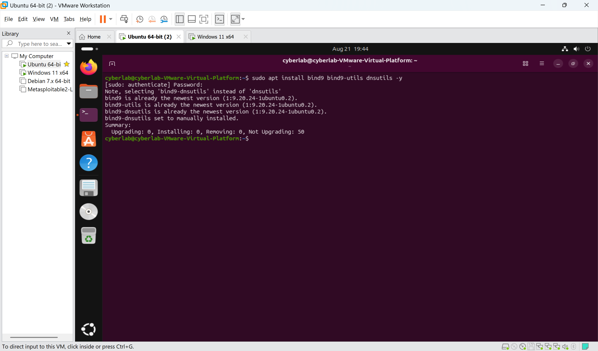
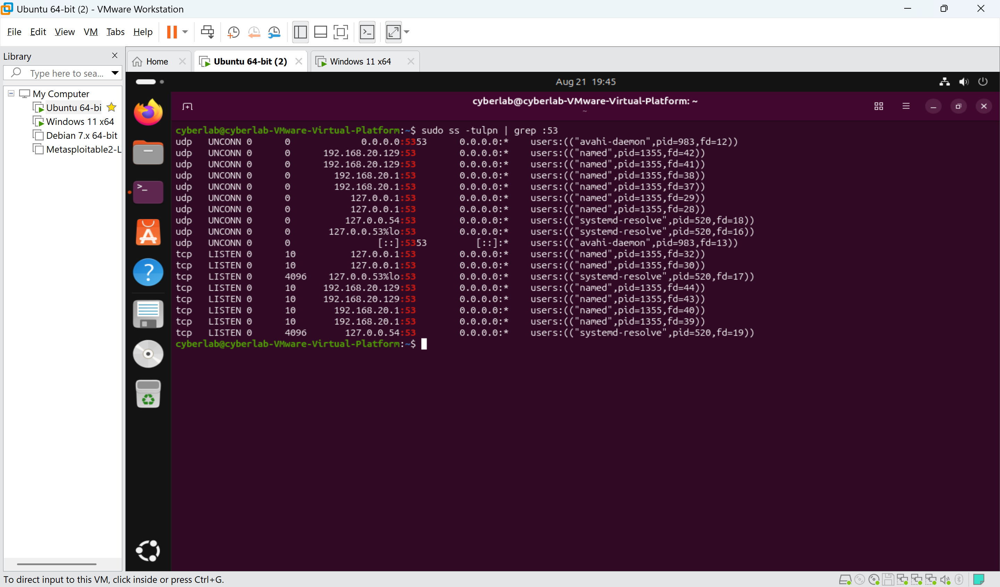
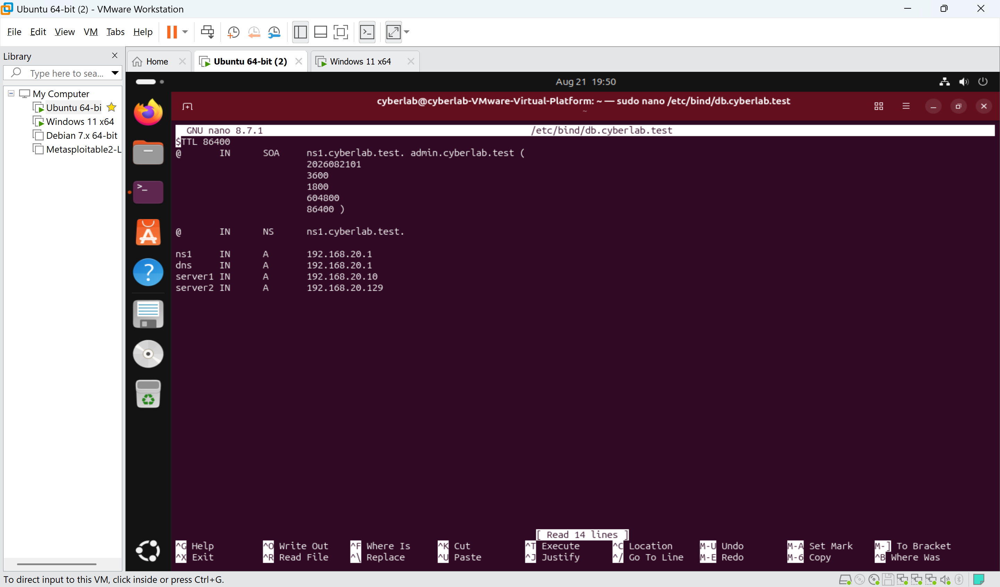
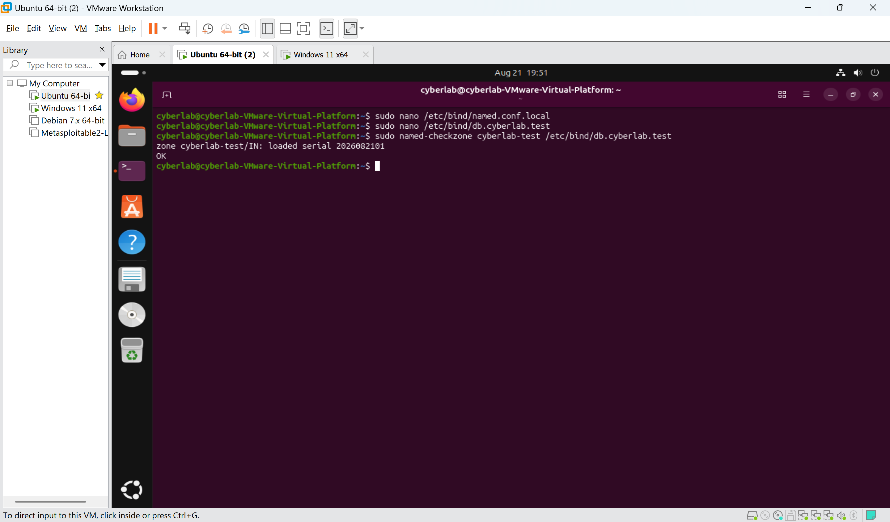
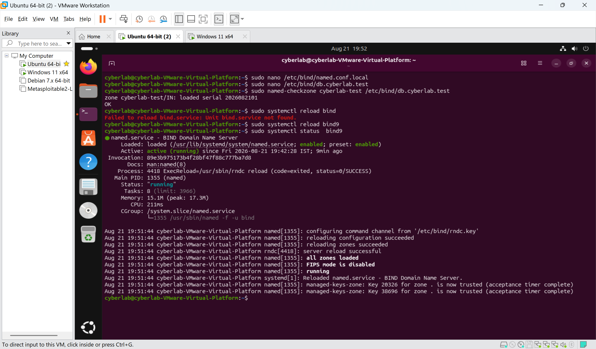
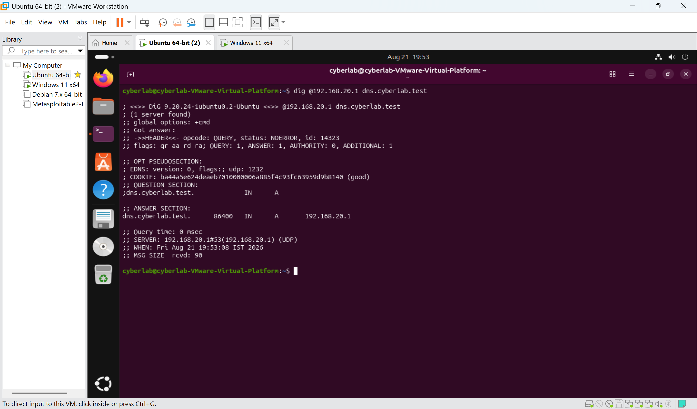
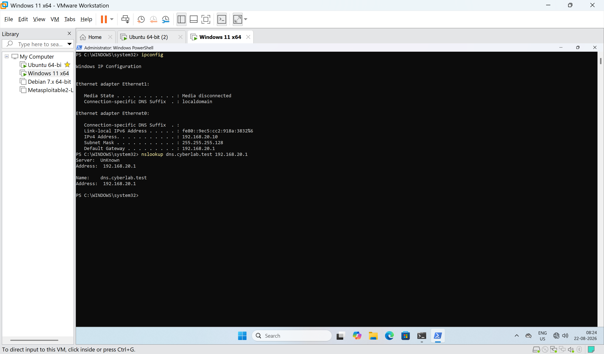
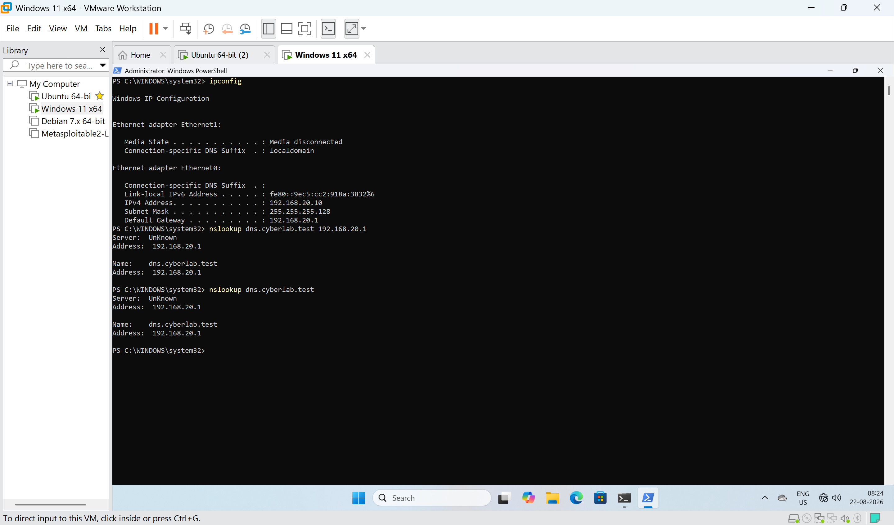

# Lab 7 — DNS Server Setup with BIND9

## Lab Overview

This lab focused on deploying and configuring a DNS (Domain Name System) server using BIND9 on Ubuntu Server.

The DNS server was integrated into the existing VMware cybersecurity lab network. A private DNS zone named `cyberlab.test` was created, and DNS records were configured for multiple hosts.

The configuration was tested locally on Ubuntu and remotely from a Windows client.

---

## Objectives

- Understand the purpose of DNS.
- Understand DNS clients, DNS servers, zones, and records.
- Understand the relationship between hostnames and IP addresses.
- Install and configure BIND9.
- Configure an authoritative DNS zone.
- Create A records for lab hosts.
- Validate BIND9 configuration and DNS zone syntax.
- Test DNS resolution using `dig` and `nslookup`.
- Configure Windows to use the Ubuntu DNS server.
- Verify DNS resolution from a Windows client.
- Understand the cybersecurity relevance of DNS.

---

## 1. Theory

### 1.1 What is DNS?

DNS stands for Domain Name System.

DNS translates human-readable names into IP addresses.

Example:

```text
server1.cyberlab.test
        ↓
192.168.20.10
```

Instead of remembering an IP address, users and applications can use a hostname.

---

### 1.2 DNS Client and DNS Server

A DNS client sends DNS queries.

A DNS server receives the queries and provides DNS responses.

In this lab:

```text
Windows Client
192.168.20.10
       |
       | DNS Query
       v
Ubuntu BIND9
192.168.20.1
       |
       | DNS Response
       v
Windows Client
```

Ubuntu acts as the DNS server because it is running BIND9.

Windows acts as the DNS client because it uses Ubuntu's DNS service to resolve names.

---

### 1.3 BIND9

BIND9 is DNS server software designed to provide DNS server functionality.

In this lab:

```text
DNS
|
└── BIND9
      |
      └── DNS server software running on Ubuntu
```

BIND9 was installed using:

```bash
sudo apt install bind9 bind9-utils dnsutils -y
```

---

### 1.4 DNS Zone

A DNS zone is a portion of the DNS namespace for which a DNS server is responsible.

The zone created in this lab was:

```text
cyberlab.test
```

The zone declaration was added to:

```text
/etc/bind/named.conf.local
```

```text
zone "cyberlab.test" {
        type master;
        file "/etc/bind/db.cyberlab.test";
};
```

This tells BIND9 that it is authoritative for `cyberlab.test` and that the zone information is stored in `/etc/bind/db.cyberlab.test`.

---

### 1.5 DNS Zone File

The DNS zone file contains records for the zone.

The zone file used in this lab was:

```text
/etc/bind/db.cyberlab.test
```

The main records were:

```text
dns     IN      A       192.168.20.1
server1 IN      A       192.168.20.10
server2 IN      A       192.168.20.129
```

These represent:

```text
dns.cyberlab.test      → 192.168.20.1
server1.cyberlab.test  → 192.168.20.10
server2.cyberlab.test  → 192.168.20.129
```

---

### 1.6 A Record

An A record maps a hostname to an IPv4 address.

Example:

```text
server1.cyberlab.test → 192.168.20.10
```

Zone file entry:

```text
server1 IN A 192.168.20.10
```

---

### 1.7 Hostname vs Host

A host is a network device or system.

A DNS hostname is a name associated with a host through a DNS record.

Example:

```text
Windows VM
IP: 192.168.20.10

DNS:
server1.cyberlab.test → 192.168.20.10
```

The DNS record does not create the host. It associates a name with the host's IP address.

A host can exist without having a DNS record.

---

### 1.8 DNS Port

DNS normally uses:

```text
UDP port 53
```

TCP port 53 is also used in certain situations, including larger responses and DNS zone transfers.

---

## 2. Lab Environment

| Machine | Role | IP Address |
|---|---|---|
| Ubuntu | DNS Server / BIND9 | `192.168.20.1` |
| Windows | DNS Client / Host | `192.168.20.10` |
| Parrot OS | DNS Client / Host | `192.168.20.11` |
| Ubuntu interface 2 | Internal network | `192.168.20.129` |

### Network Structure

```text
192.168.20.0/25
```

and:

```text
192.168.20.128/25
```

Ubuntu has interfaces on both internal networks.

---

## 3. Installing BIND9

```bash
sudo apt update
```

```bash
sudo apt install bind9 bind9-utils dnsutils -y
```

The service was checked using:

```bash
sudo systemctl status bind9
```

Expected result:

```text
Active: active (running)
```

---

## 4. Checking DNS Port 53

```bash
sudo ss -tulpn | grep :53
```

BIND9 was found listening on DNS port 53.

---

## 5. Configuring BIND9 Options

The options file was edited:

```bash
sudo nano /etc/bind/named.conf.options
```

Configuration:

```text
options {
        directory "/var/cache/bind";

        listen-on {
                127.0.0.1;
                192.168.20.1;
                192.168.20.129;
        };

        listen-on-v6 { none; };

        allow-query {
                localhost;
                192.168.20.0/25;
                192.168.20.128/25;
        };

        recursion yes;

        forwarders {
                8.8.8.8;
                1.1.1.1;
        };

        dnssec-validation auto;
};
```

### Configuration Purpose

`listen-on` specifies the IPv4 addresses where BIND accepts DNS queries.

`allow-query` restricts DNS queries to the internal lab networks.

The configured networks were:

```text
192.168.20.0/25
192.168.20.128/25
```

DNS forwarders were configured as:

```text
8.8.8.8
1.1.1.1
```

IPv6 listening was disabled because the lab uses IPv4.

---

## 6. Validating BIND Configuration

```bash
sudo named-checkconf
```

No output indicated that the configuration syntax was valid.

The options file was also checked:

```bash
sudo named-checkconf /etc/bind/named.conf.options
```

---

## 7. Creating the DNS Zone

```bash
sudo nano /etc/bind/named.conf.local
```

Added:

```text
zone "cyberlab.test" {
        type master;
        file "/etc/bind/db.cyberlab.test";
};
```

This configured Ubuntu as the authoritative DNS server for the `cyberlab.test` zone.

---

## 8. Creating the DNS Zone File

```bash
sudo nano /etc/bind/db.cyberlab.test
```

Configuration:

```text
$TTL 86400
@       IN      SOA     ns1.cyberlab.test. admin.cyberlab.test. (
                        2026082101
                        3600
                        1800
                        604800
                        86400 )

@       IN      NS      ns1.cyberlab.test.

ns1     IN      A       192.168.20.1
dns     IN      A       192.168.20.1
server1 IN      A       192.168.20.10
server2 IN      A       192.168.20.129
```

---

## 9. DNS Records

| DNS Name | Type | IP Address |
|---|---|---|
| `ns1.cyberlab.test` | A | `192.168.20.1` |
| `dns.cyberlab.test` | A | `192.168.20.1` |
| `server1.cyberlab.test` | A | `192.168.20.10` |
| `server2.cyberlab.test` | A | `192.168.20.129` |

The `@` symbol represents the current zone, `cyberlab.test`.

---

## 10. Validating the DNS Zone

```bash
sudo named-checkzone cyberlab.test /etc/bind/db.cyberlab.test
```

Expected result:

```text
zone cyberlab.test/IN: loaded serial 2026082101
OK
```

---

## 11. Reloading BIND9

```bash
sudo systemctl reload bind9
```

Then:

```bash
sudo systemctl status bind9
```

Expected:

```text
Active: active (running)
```

The logs confirmed that the `cyberlab.test` zone was successfully loaded.

---

## 12. Local DNS Testing

```bash
dig @192.168.20.1 dns.cyberlab.test
```

Expected answer:

```text
dns.cyberlab.test.    86400    IN    A    192.168.20.1
```

This confirms:

```text
dns.cyberlab.test
        ↓
192.168.20.1
```

---

## 13. Testing Another DNS Record

```bash
dig @192.168.20.1 server1.cyberlab.test
```

Expected:

```text
server1.cyberlab.test.    86400    IN    A    192.168.20.10
```

This confirms:

```text
server1.cyberlab.test
        ↓
192.168.20.10
```

---

## 14. Windows DNS Client

Windows was configured with:

```text
IPv4 Address: 192.168.20.10
Subnet Mask: 255.255.255.128
Default Gateway: 192.168.20.1
```

The initial DNS servers were:

```text
8.8.8.8
1.1.1.1
```

Windows was then configured to use:

```text
DNS Server: 192.168.20.1
```

---

## 15. Testing DNS from Windows

Explicit DNS server test:

```cmd
nslookup dns.cyberlab.test 192.168.20.1
```

Expected:

```text
Server Address: 192.168.20.1
Name: dns.cyberlab.test
Address: 192.168.20.1
```

Another record:

```cmd
nslookup server1.cyberlab.test 192.168.20.1
```

Expected:

```text
Name: server1.cyberlab.test
Address: 192.168.20.10
```

---

## 16. Testing Automatic DNS Resolution

After configuring Windows to use `192.168.20.1` as its DNS server:

```cmd
nslookup server1.cyberlab.test
```

Windows automatically queried:

```text
192.168.20.1
```

and received:

```text
server1.cyberlab.test
→ 192.168.20.10
```

The same was confirmed with:

```cmd
nslookup dns.cyberlab.test
```

Result:

```text
dns.cyberlab.test
→ 192.168.20.1
```

This confirmed that Windows was using the Ubuntu BIND9 server as its DNS resolver.

---

## 17. DNS Architecture

```text
                         DNS Queries
                              |
                              v
                    +------------------+
                    | Ubuntu DNS       |
                    | BIND9            |
                    | 192.168.20.1     |
                    +--------+---------+
                             |
                     cyberlab.test zone
                             |
            +----------------+----------------+
            |                |                |
            v                v                v
       dns.cyberlab     server1.cyberlab  server2.cyberlab
            |                |                |
            v                v                v
      192.168.20.1     192.168.20.10     192.168.20.129
```

---

## 18. DNS and Hosts

A host is a network device or system.

A DNS record associates a hostname with a host's IP address.

Example:

```text
Windows VM
192.168.20.10
      ^
      |
server1.cyberlab.test
```

A DNS record does not create the host.

A host can exist without having a DNS record.

For example, Parrot OS has:

```text
192.168.20.11
```

If no DNS record exists for it, BIND9 will not automatically discover it.

---

## 19. DNS vs Network Connectivity

DNS and network connectivity are separate concepts.

This can work:

```text
ping 192.168.20.11
```

even if this does not exist:

```text
parrot.cyberlab.test
```

DNS provides name-to-address information. It does not automatically discover every device on a network.

---

## 24.Results

The DNS lab was successfully completed.

A functional BIND9 DNS server was deployed on Ubuntu and configured with the `cyberlab.test` zone.

The following DNS records were successfully created and tested:

```text
dns.cyberlab.test      → 192.168.20.1
server1.cyberlab.test  → 192.168.20.10
server2.cyberlab.test  → 192.168.20.129
```

The Windows VM was configured to use the Ubuntu DNS server at:

```text
192.168.20.1
```

DNS resolution was successfully verified using Linux and Windows DNS tools.

This lab established the foundation for understanding DNS-based reconnaissance, service discovery, network enumeration, and security monitoring.
---

# 23. Screenshots

## Screenshot 1 — BIND9 Installation and Service Status



---

## Screenshot 2 — DNS Port 53 Verification



---

## Screenshot 3 — BIND9 Configuration Validation


---

## Screenshot 4 — DNS Zone Configuration


---

## Screenshot 5 — DNS Zone File



---

## Screenshot 6 — DNS Zone Validation



---

## Screenshot 7 — BIND9 Zone Reload



---

## Screenshot 8 — Local DNS Resolution with dig



---

## Screenshot 9 — Windows DNS Resolution



---

## Screenshot 10 — Windows Using Ubuntu DNS Server



---

