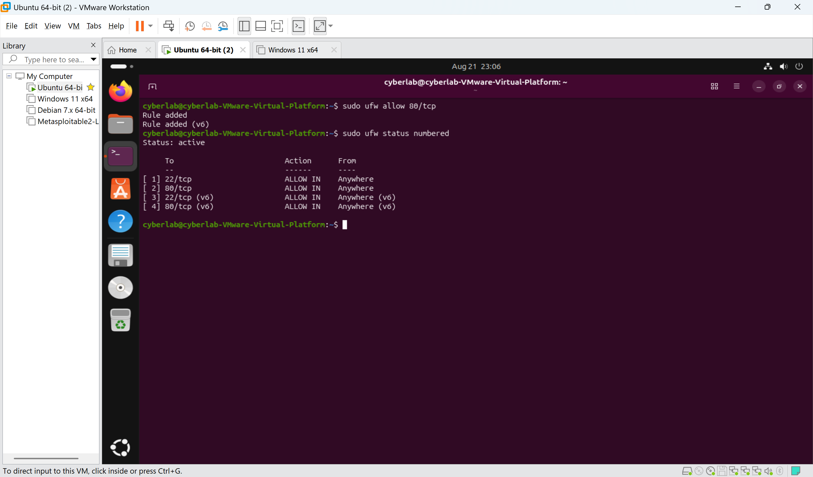

# Lab 08 --- Host-Based Firewalls with UFW

## Aim

To understand the concept of host-based firewalls and configure, manage,
and test the Ubuntu Linux firewall using UFW (Uncomplicated Firewall).
The lab demonstrates how firewall rules control access to network
services and how firewall behavior can be verified from a separate
Parrot OS machine.

------------------------------------------------------------------------

## Objectives

-   Understand what a host-based firewall is.
-   Understand how UFW works on Ubuntu.
-   Identify network services and listening ports.
-   Configure firewall rules for SSH and HTTP.
-   Enable UFW with a default-deny incoming policy.
-   View and manage numbered firewall rules.
-   Understand UFW application profiles.
-   Test an allowed service from Parrot OS.
-   Test a filtered service using Nmap.
-   Remove temporary firewall rules and restore the intended
    configuration.
-   Relate host firewalls to cybersecurity concepts such as least
    privilege, attack-surface reduction, defense in depth, network
    segmentation, and access control.

------------------------------------------------------------------------

## Requirements

-   Ubuntu Linux virtual machine
-   Parrot OS virtual machine
-   VMware Workstation
-   Network connectivity between Ubuntu and Parrot OS
-   UFW installed on Ubuntu
-   Apache web server running on Ubuntu
-   SSH service running on Ubuntu
-   Nmap installed on Parrot OS

------------------------------------------------------------------------

## Lab Environment

  -----------------------------------------------------------------------
  System                  Role                    Purpose
  ----------------------- ----------------------- -----------------------
  Ubuntu                  Target / Firewall Host  Runs UFW, SSH, Apache,
                                                  and other network
                                                  services

  Parrot OS               Testing Host            Tests network
                                                  connectivity and
                                                  firewall behavior

  VMware Workstation      Virtualization Platform Provides the virtual
                                                  lab network
  -----------------------------------------------------------------------

Ubuntu used the lab address `192.168.20.1` during the testing performed
in this lab.

------------------------------------------------------------------------

# Part 1 --- Understanding Host Firewalls

A firewall is a security control that regulates network traffic
according to defined rules.

A host-based firewall runs directly on an individual computer and
controls traffic entering or leaving that host.

``` text
Parrot OS
    |
    | Network traffic
    v
+-------------------+
| Ubuntu Host       |
|                   |
|   UFW Firewall    |
|        |          |
|   +----+----+     |
|   |         |     |
|  SSH     Apache   |
|  22        80     |
+-------------------+
```

A firewall can allow required traffic while blocking unnecessary or
unauthorized traffic.

------------------------------------------------------------------------

# Part 2 --- Check the Initial UFW State

The initial firewall state was checked with:

``` bash
sudo ufw status
```

and:

``` bash
sudo ufw status verbose
```

The result showed:

``` text
Status: inactive
```

This established the initial state of the host firewall before
configuration.


**Observation:** UFW was initially inactive. This was used as the
baseline state for the lab.

------------------------------------------------------------------------

# Part 3 --- Identify Listening Services

Before configuring the firewall, the services listening on the Ubuntu
host were identified:

``` bash
sudo ss -tulpn
```

A focused check was also performed for SSH:

``` bash
sudo ss -tulpn | grep :22
```

The output showed several services, including:

-   SSH on TCP port 22
-   Apache on TCP port 80
-   DNS/BIND on port 53
-   CUPS on port 631

SSH was confirmed to be listening on:

``` text
0.0.0.0:22
[::]:22
```


**Observation:** The system had multiple network services listening.
This demonstrated why host-level access control is important: every
exposed service can represent a potential attack surface.

------------------------------------------------------------------------

# Part 4 --- Configure SSH Access

Because SSH was being used to administer the Ubuntu machine, SSH access
was explicitly allowed before enabling the firewall.

The command used was:

``` bash
sudo ufw allow ssh
```

UFW reported:

``` text
Rules updated
Rules updated (v6)
```

The configured rule was verified with:

``` bash
sudo ufw show added
```

The output showed:

``` text
ufw allow 22/tcp
```


**Observation:** The SSH rule was configured while UFW was still
inactive. Adding a rule and enabling the firewall are separate
operations.

------------------------------------------------------------------------

# Part 5 --- Enable UFW

After ensuring SSH was allowed, UFW was enabled:

``` bash
sudo ufw enable
```

The firewall reported:

``` text
Firewall is active and enabled on system startup
```

The configuration was verified with:

``` bash
sudo ufw status verbose
```

The resulting policy included:

``` text
Status: active
Default: deny (incoming), allow (outgoing)
```

SSH was allowed for both IPv4 and IPv6.


**Observation:** UFW was now actively enforcing the firewall policy.
Incoming traffic was denied by default unless explicitly permitted.

------------------------------------------------------------------------

# Part 6 --- View Numbered Firewall Rules

The active rules were displayed with:

``` bash
sudo ufw status numbered
```

The output showed:

``` text
[1] 22/tcp       ALLOW IN    Anywhere
[2] 22/tcp (v6)  ALLOW IN    Anywhere (v6)
```


**Observation:** Numbered rules make it easier to identify and delete
individual firewall rules.

------------------------------------------------------------------------

# Part 7 --- View UFW Application Profiles

UFW provides predefined application profiles that can be used instead of
manually specifying ports.

The available profiles were viewed with:

``` bash
sudo ufw app list
```

The system displayed profiles including:

``` text
Apache
Apache Full
Apache Secure
BIND9
CUPS
OpenSSH
WSGI
```


**Observation:** Application profiles simplify firewall configuration by
associating service names with the required ports.

------------------------------------------------------------------------

# Part 8 --- Allow HTTP Traffic

The earlier `ss` output showed that Apache was listening on TCP port 80.

HTTP access was therefore explicitly allowed:

``` bash
sudo ufw allow 80/tcp
```

The resulting rules were checked using:

``` bash
sudo ufw status numbered
```

The configuration included:

``` text
22/tcp       ALLOW IN
80/tcp       ALLOW IN
22/tcp (v6)  ALLOW IN
80/tcp (v6)  ALLOW IN
```



**Observation:** The firewall was configured to permit HTTP traffic to
the Apache web server.

------------------------------------------------------------------------

# Part 9 --- Test the Allowed HTTP Service

The Ubuntu web server was tested from Parrot OS.

The HTTP service was accessed with:

``` bash
curl http://192.168.20.1
```

The response contained the Apache default web page HTML.

The service was also verified using Nmap:

``` bash
nmap -p 80 192.168.20.1
```

The scan reported:

``` text
80/tcp open http
```


**Observation:** TCP port 80 was reachable because UFW explicitly
allowed the traffic and Apache was listening on the port.

------------------------------------------------------------------------

# Part 10 --- Create a Temporary Deny Rule for DNS

The earlier service enumeration showed that BIND9 was listening on port
53.

A temporary firewall rule was created to demonstrate traffic filtering:

``` bash
sudo ufw deny 53/tcp
```

The rule was verified with:

``` bash
sudo ufw status numbered
```

The output included:

``` text
53/tcp    DENY IN    Anywhere
53/tcp    DENY IN    Anywhere (v6)
```


**Observation:** A service can be listening on a port while the host
firewall prevents remote access to that port.

------------------------------------------------------------------------

# Part 11 --- Verify Firewall Filtering with Nmap

From Parrot OS, TCP port 53 was scanned:

``` bash
nmap -p 53 192.168.20.1
```

The result was:

``` text
53/tcp filtered domain
```

The `filtered` state indicates that Nmap could not determine that the
port was reachable because network filtering prevented normal access.


**Observation:** The test demonstrated the practical effect of a
firewall rule. BIND9 could be listening on port 53, but the firewall
filtered incoming TCP/53 traffic.

------------------------------------------------------------------------

# Part 12 --- Remove the Temporary Rule

The DNS deny rule was only required for the demonstration, so it was
removed:

``` bash
sudo ufw delete deny 53/tcp
```

UFW reported:

``` text
Rule deleted
Rule deleted (v6)
```

The final rules were verified:

``` bash
sudo ufw status numbered
```

The remaining rules were:

``` text
22/tcp       ALLOW IN    Anywhere
80/tcp       ALLOW IN    Anywhere
22/tcp (v6)  ALLOW IN    Anywhere (v6)
80/tcp (v6)  ALLOW IN    Anywhere (v6)
```

This left the firewall in the intended final state.

------------------------------------------------------------------------

# Commands Used

  -----------------------------------------------------------------------
  Command                             Purpose
  ----------------------------------- -----------------------------------
  `sudo ufw status`                   Check basic UFW status

  `sudo ufw status verbose`           Display detailed firewall status
                                      and default policies

  `sudo ss -tulpn`                    Identify listening TCP/UDP services

  `sudo ss -tulpn \| grep :22`        Check whether SSH is listening

  `sudo ufw allow ssh`                Allow SSH using the UFW
                                      application/service name

  `sudo ufw show added`               Display configured UFW user rules

  `sudo ufw enable`                   Enable and enforce UFW

  `sudo ufw status numbered`          Display firewall rules with numbers

  `sudo ufw app list`                 Display available UFW application
                                      profiles

  `sudo ufw allow 80/tcp`             Allow incoming HTTP traffic

  `sudo ufw deny 53/tcp`              Temporarily deny incoming TCP/53

  `sudo ufw delete deny 53/tcp`       Remove the temporary DNS deny rule

  `curl http://192.168.20.1`          Test HTTP connectivity

  `nmap -p 80 192.168.20.1`           Test TCP/80

  `nmap -p 53 192.168.20.1`           Test TCP/53 filtering
  -----------------------------------------------------------------------

------------------------------------------------------------------------

# How a Host Firewall Works

The basic packet-processing concept demonstrated in this lab is:

``` text
Network
   |
   v
Ubuntu Network Interface
   |
   v
Linux Network Stack
   |
   v
Netfilter / nftables
   |
   v
Firewall Rules
   |
   +---- ALLOW ----> Service
   |
   +---- DENY -----> Blocked
```

UFW provides a simplified command-line interface for configuring
firewall policies. The actual packet filtering is performed through
Linux's kernel networking firewall infrastructure.

The practical relationship is:

``` text
Administrator
      |
      v
     UFW
      |
      v
Netfilter / nftables
      |
      v
Linux Kernel
      |
      v
Network Traffic
```

------------------------------------------------------------------------

# Important Firewall Concepts

## 1. Default Deny

The lab used:

``` text
Default: deny (incoming), allow (outgoing)
```

This means incoming connections are blocked unless an explicit rule
allows them.

This follows an **allow-by-exception** security model.

------------------------------------------------------------------------

## 2. Least Privilege

Only services that are actually required should be exposed.

For this lab:

``` text
SSH   → ALLOW
HTTP  → ALLOW
Other unnecessary services → DENY
```

This follows the **Principle of Least Privilege**.

------------------------------------------------------------------------

## 3. Attack Surface Reduction

Every externally reachable service can provide a potential attack path.

Reducing unnecessary exposed ports reduces the host's network attack
surface.

``` text
More exposed services
        ↓
Larger attack surface
        ↓
More potential attack paths
```

A restrictive firewall helps reduce this exposure.

------------------------------------------------------------------------

## 4. Defense in Depth

A firewall should not be considered the only security control.

A secure system can use multiple layers:

``` text
Network Segmentation
        ↓
Host Firewall
        ↓
Secure Service Configuration
        ↓
Authentication
        ↓
Application Security
        ↓
Logging and Monitoring
        ↓
Detection and Response
```

If one control fails, other controls can still provide protection.

------------------------------------------------------------------------

## 5. Access Control

Firewall rules are a form of network-level access control.

For example:

``` text
TCP/80 → ALLOW
TCP/53 → DENY
```

The firewall is making an authorization decision about network traffic.

------------------------------------------------------------------------

## 6. Network Segmentation

Firewalls can restrict communication between networks and systems.

For example:

``` text
Internet → Web Server       ALLOW
Internet → Database Server  DENY
Web → Database              ALLOW
Admin → SSH                 ALLOW
```

This is closely related to network segmentation and Zero Trust
architecture.

------------------------------------------------------------------------

## 7. IPv4 and IPv6 Security

UFW created separate rules for IPv4 and IPv6:

``` text
22/tcp
22/tcp (v6)

80/tcp
80/tcp (v6)
```

When IPv6 is enabled, both protocol versions should be considered when
designing firewall policy.

------------------------------------------------------------------------

# Relationship to the OSI Model

The firewall rules used in this lab primarily involved information
associated with:

### Layer 3 --- Network

-   Source IP
-   Destination IP

### Layer 4 --- Transport

-   TCP
-   UDP
-   Source port
-   Destination port

For example:

``` text
Source:      Parrot OS
Destination: 192.168.20.1
Protocol:    TCP
Port:        80
```

UFW can use these attributes when applying firewall policies.

------------------------------------------------------------------------

# Firewall vs Other Security Controls

  Security Control       Primary Purpose
  ---------------------- ----------------------------------------------
  Firewall               Network access control
  IDS                    Detect suspicious network activity
  IPS                    Detect and block suspicious network activity
  Antivirus/EDR          Endpoint detection and response
  Authentication         Verify user/device identity
  Network segmentation   Limit communication between systems
  SIEM                   Centralize and analyze security events

A firewall complements these controls rather than replacing them.

------------------------------------------------------------------------

# Relationship to the CIA Triad

The firewall supports the three major information-security goals:

### Confidentiality

Restricts unauthorized network access to services.

### Integrity

Reduces unauthorized network paths that could be used to compromise or
modify systems.

### Availability

Can restrict unwanted traffic and help protect services from some
network-based threats.

The firewall is one security control contributing to the overall CIA
objectives.

------------------------------------------------------------------------

# Relationship to the NIST Cybersecurity Framework

Host firewalls can support multiple parts of the NIST Cybersecurity
Framework.

  Function   Firewall-related activity
  ---------- ----------------------------------------------------
  Identify   Identify systems, services, ports, and assets
  Protect    Configure access-control and firewall rules
  Detect     Monitor firewall logs and connection attempts
  Respond    Investigate suspicious traffic and modify controls
  Recover    Restore secure firewall configuration

The lab particularly demonstrated **Identify** and **Protect**, with
elements of **Detect** through network testing and firewall behavior
analysis.

------------------------------------------------------------------------

# Relationship to MITRE ATT&CK

Attackers commonly perform network reconnaissance to discover exposed
services.

A simplified attack path is:

``` text
Reconnaissance
      ↓
Network Scanning
      ↓
Service Enumeration
      ↓
Vulnerability Identification
      ↓
Exploitation
```

In this lab, Nmap was used to demonstrate the reconnaissance stage:

``` bash
nmap -p 80 192.168.20.1
nmap -p 53 192.168.20.1
```

The firewall reduced the accessibility of a service by filtering TCP/53.

------------------------------------------------------------------------

# Key Observations

1.  UFW was initially inactive.
2.  Ubuntu had multiple network services listening.
3.  SSH was explicitly allowed before enabling the firewall.
4.  UFW was enabled with incoming traffic denied by default.
5.  HTTP traffic was explicitly allowed.
6.  Apache remained reachable through TCP/80.
7.  TCP/53 was temporarily denied.
8.  Nmap reported TCP/53 as `filtered`.
9.  The temporary DNS rule was removed after testing.
10. The final firewall configuration retained only the intended SSH and
    HTTP allow rules.

------------------------------------------------------------------------

# Security Lessons Learned

This lab demonstrated that:

-   A listening service and a reachable service are not necessarily the
    same thing.
-   Firewalls provide network-level access control.
-   Default-deny policies reduce unnecessary exposure.
-   Least privilege applies to network access as well as user
    permissions.
-   Firewall rules can reduce the attack surface.
-   Nmap can be used to verify the external effect of firewall policies.
-   IPv4 and IPv6 should both be considered.
-   Host firewalls are one layer of defense in depth.
-   Firewall configuration should be reviewed and cleaned up after
    temporary testing.
-   Understanding TCP/IP, ports, services, and network scanning is
    essential for firewall administration and cybersecurity.

------------------------------------------------------------------------

# Result

The Ubuntu host firewall was successfully configured and tested using
UFW.

The final configuration:

``` text
Status: active
Default: deny incoming
Default: allow outgoing

22/tcp       ALLOW IN
80/tcp       ALLOW IN
22/tcp (v6)  ALLOW IN
80/tcp (v6)  ALLOW IN
```

SSH and HTTP access were permitted, while a temporary TCP/53 deny rule
was successfully demonstrated and removed.

The lab successfully demonstrated **host-based firewall configuration,
network access control, default-deny policy, least privilege,
attack-surface reduction, firewall filtering, network reconnaissance,
and defense in depth**.
