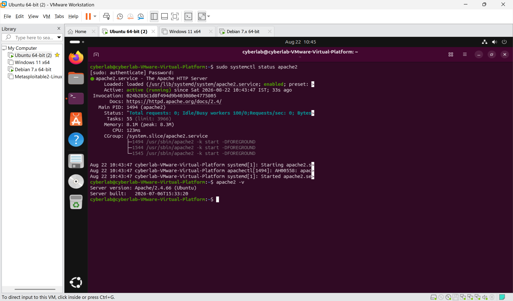
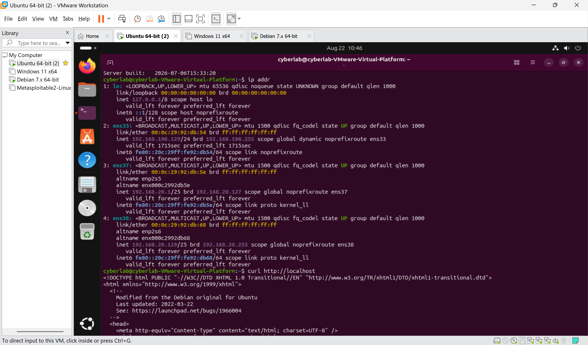
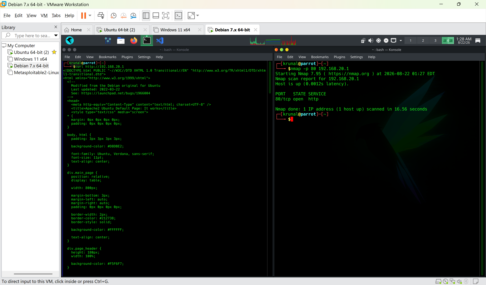
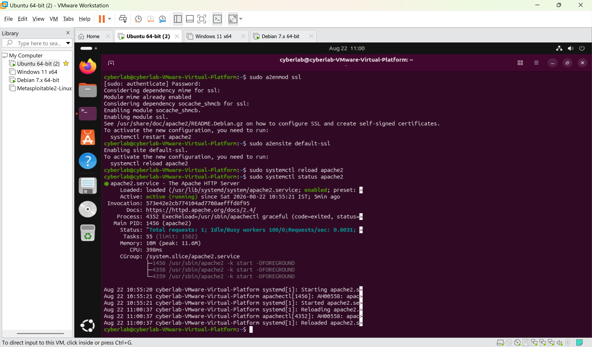
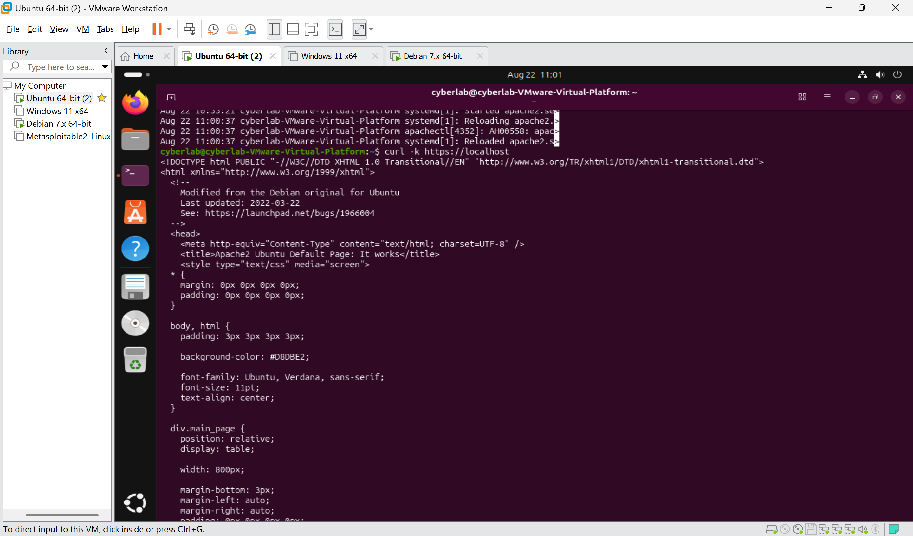
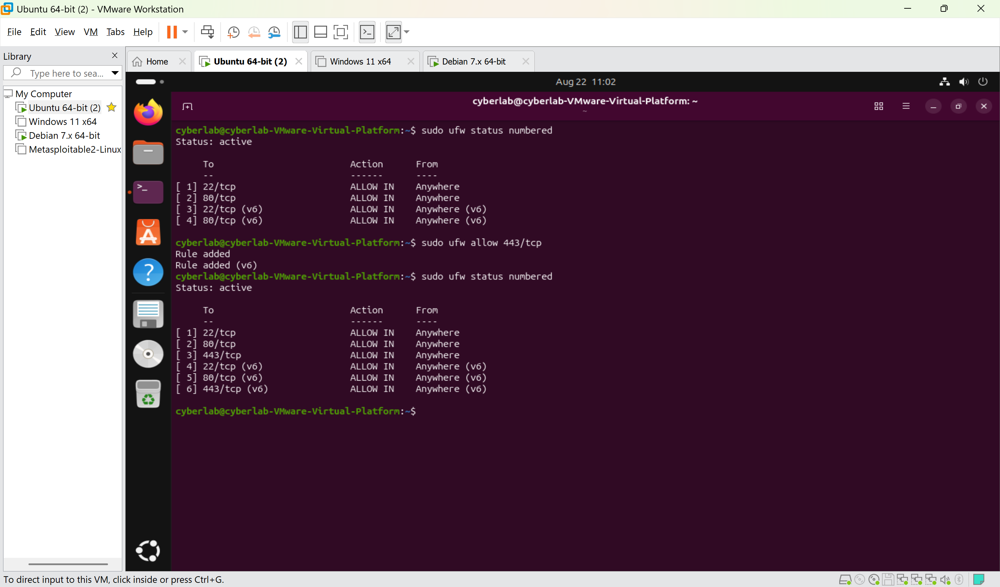
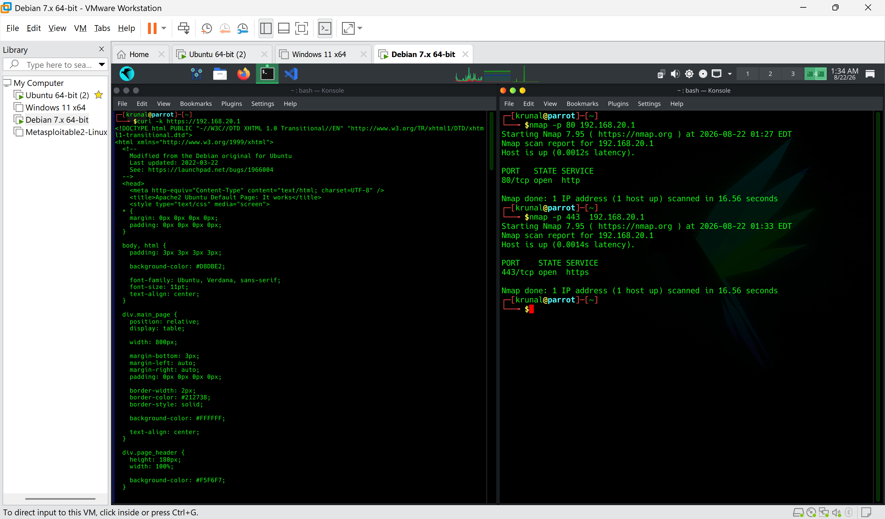
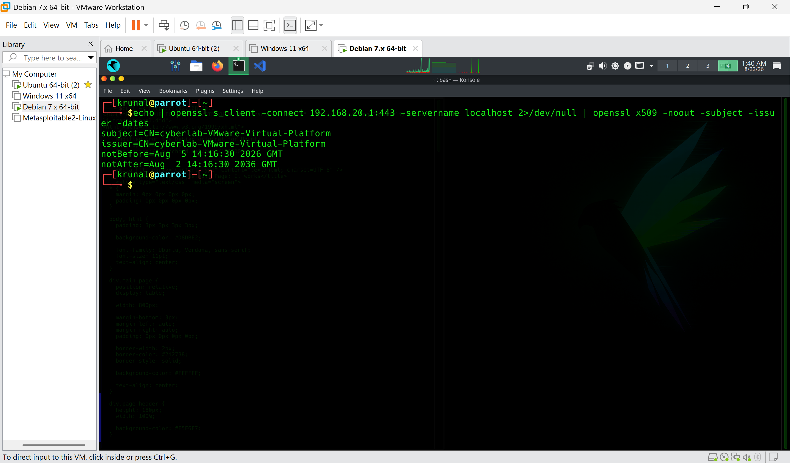
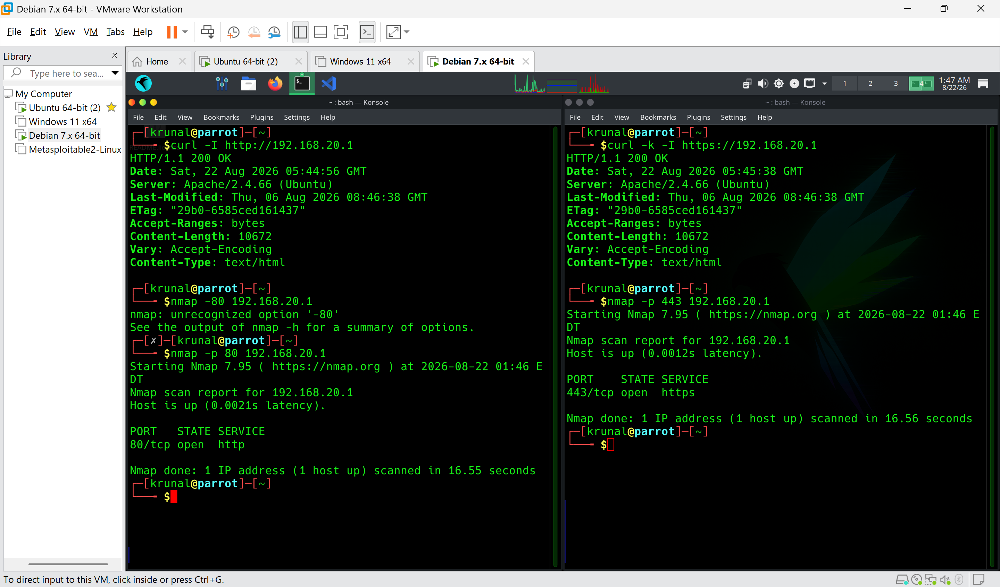

# Lab 09 — Basic Web Server Hosting and HTTP/HTTPS Certificate

## Aim

To deploy and test a basic Apache web server on Ubuntu, understand HTTP and HTTPS communication, configure Apache for TLS, and inspect a self-signed X.509 certificate using OpenSSL.

---

## Objectives

- Understand the purpose of a web server.
- Understand Apache HTTP Server and its role.
- Verify that Apache is installed and running.
- Identify the web server IP address and listening ports.
- Understand the Apache web root.
- Test HTTP locally and remotely.
- Configure HTTPS using Apache SSL support.
- Understand TLS and digital certificates.
- Allow HTTPS through the host firewall.
- Test HTTPS from Parrot OS.
- Inspect the TLS certificate using OpenSSL.
- Compare HTTP and HTTPS.
- Relate the lab to confidentiality, integrity, authentication, PKI, and encryption in transit.

---

## Lab Environment

| System | Role | Purpose |
|---|---|---|
| Ubuntu | Web Server | Runs Apache HTTP/HTTPS |
| Parrot OS | Client / Testing Host | Tests HTTP, HTTPS, Nmap, and TLS |
| VMware Workstation | Virtualization | Provides the lab network |

Ubuntu web server address used during the lab:

```text
192.168.20.1
```

---

# Part 1 — Web Server Fundamentals

A web server is software that accepts HTTP/HTTPS requests from clients and returns web content.

In this lab:

```text
Parrot OS
    |
    | HTTP / HTTPS
    v
Ubuntu
    |
    v
Apache Web Server
    |
    v
Web Content
```

Apache acts as the server-side software responsible for handling HTTP and HTTPS requests.

---

# Part 2 — Verify Apache Installation and Status

Apache was already installed on the Ubuntu system.

The service was checked using:

```bash
sudo systemctl status apache2
```

The Apache version was checked using:

```bash
apache2 -v
```

Apache was confirmed to be:

```text
Active: active (running)
```

The installed version was Apache:

```text
2.4.66
```

### Screenshot 1 — Apache Status and Version



**Observation:** Apache was installed, running, and enabled as a system service.

---

# Part 3 — Identify the Ubuntu Web Server Address

The Ubuntu network configuration was inspected with:

```bash
ip addr
```

The lab interface used the address:

```text
192.168.20.1
```

The server's local HTTP service was tested using:

```bash
curl http://localhost
```

Apache returned its HTML response.

### Screenshot 2 — Ubuntu IP Address and Local HTTP Test



**Observation:** The Ubuntu host was reachable locally and Apache successfully returned HTTP content.

---

# Part 4 — Understand the Apache Web Root

Apache commonly serves the default website from:

```text
/var/www/html/
```

The main webpage is commonly:

```text
/var/www/html/index.html
```

The basic request flow is:

```text
Client
   |
   | HTTP request
   v
Apache
   |
   v
/var/www/html/
   |
   v
index.html
   |
   v
HTTP response
```

This directory is therefore an important location to understand when administering an Apache web server.

---

# Part 5 — Test HTTP From Parrot OS

The Ubuntu Apache server was accessed remotely from Parrot OS:

```bash
curl http://192.168.20.1
```

The Apache HTML response was returned successfully.

The HTTP port was then verified with Nmap:

```bash
nmap -p 80 192.168.20.1
```

Expected result:

```text
80/tcp open http
```

### Screenshot 3 — Remote HTTP Test



**Observation:** Parrot OS successfully reached Apache over TCP port 80.

---

# Part 6 — Enable Apache SSL Support

Apache's SSL module was enabled using:

```bash
sudo a2enmod ssl
```

The default SSL virtual host was enabled:

```bash
sudo a2ensite default-ssl
```

Apache was restarted:

```bash
sudo systemctl restart apache2
```

The service was verified:

```bash
sudo systemctl status apache2
```

### Screenshot 4 — Apache SSL Configuration



**Observation:** Apache SSL support and the default HTTPS virtual host were enabled successfully.

---

# Part 7 — Test HTTPS Locally

HTTPS was tested locally using:

```bash
curl -k https://localhost
```

The `-k` option tells curl to continue without verifying whether the certificate is trusted.

This is appropriate for the lab because the certificate is self-signed.

The communication flow is:

```text
Client
   |
   | HTTPS / TLS
   v
Apache
   |
   v
TLS Certificate
   |
   v
Encrypted HTTP
```

### Screenshot 5 — Local HTTPS Test



**Observation:** Apache successfully handled an HTTPS request.

---

# Part 8 — Allow HTTPS Through UFW

Because HTTPS uses TCP port 443, the host firewall must allow the service.

The firewall configuration was checked:

```bash
sudo ufw status numbered
```

If required, HTTPS was allowed using:

```bash
sudo ufw allow 443/tcp
```

The final rules included HTTP and HTTPS:

```text
80/tcp   ALLOW IN
443/tcp  ALLOW IN
```

### Screenshot 6 — HTTP and HTTPS Firewall Rules



**Observation:** TCP/443 was explicitly allowed so remote clients could access the HTTPS service.

---

# Part 9 — Test HTTPS From Parrot OS

From Parrot OS, HTTPS was tested using:

```bash
curl -k https://192.168.20.1
```

The `-k` option was required because the certificate is self-signed and is not trusted by the client.

The HTTPS service was also checked with:

```bash
nmap -p 443 192.168.20.1
```

Expected result:

```text
443/tcp open https
```

### Screenshot 7 — Remote HTTPS Test



**Observation:** Parrot OS successfully reached the Apache HTTPS service over TCP/443.

---

# Part 10 — Inspect the TLS Certificate

The TLS connection was inspected using:

```bash
openssl s_client -connect 192.168.20.1:443 -servername localhost
```

This command establishes a TLS connection to Apache and displays detailed TLS and certificate information.

A cleaner certificate inspection was performed using:

```bash
echo | openssl s_client -connect 192.168.20.1:443 -servername localhost 2>/dev/null | openssl x509 -noout -subject -issuer -dates
```

The command extracts selected certificate information:

- Subject
- Issuer
- Validity dates

### Screenshot 8 — TLS Certificate Inspection



**Observation:** The certificate information was successfully extracted from the HTTPS service.

---

# Part 11 — Understand the Self-Signed Certificate

A self-signed certificate is a certificate that is signed by the same entity that created it rather than by a publicly trusted Certificate Authority.

Conceptually:

```text
Self-Signed Certificate

Subject
   |
   v
localhost

Issuer
   |
   v
localhost
```

For a public website, the issuer would normally be a trusted Certificate Authority (CA).

A self-signed certificate is suitable for a private lab because it allows TLS practice without requiring a public domain or trusted CA.

---

# Part 12 — Compare HTTP and HTTPS

HTTP:

```text
Parrot
   |
   | TCP/80
   | HTTP
   v
Apache
```

HTTPS:

```text
Parrot
   |
   | TCP/443
   | TLS + HTTP
   v
Apache
```

The important security difference is that HTTPS uses TLS to protect HTTP communication in transit.

A final port check can be performed with:

```bash
nmap -p 80,443 192.168.20.1
```

Expected:

```text
80/tcp  open http
443/tcp open https
```

### Screenshot 9 — HTTP and HTTPS Ports



**Observation:** Both HTTP and HTTPS services were reachable on their respective TCP ports.

---

# Part 13 — HTTP and HTTPS Response Headers

The HTTP response headers can be viewed with:

```bash
curl -I http://192.168.20.1
```

The HTTPS response headers can be viewed with:

```bash
curl -k -I https://192.168.20.1
```

Both services can return HTTP responses, but HTTPS transports the HTTP communication through a TLS-protected connection.

### Screenshot 10 — HTTP vs HTTPS Response


---

# Important Concepts

## HTTP

HTTP stands for **Hypertext Transfer Protocol**.

The traditional HTTP service uses:

```text
TCP/80
```

HTTP itself does not provide TLS encryption.

---

## HTTPS

HTTPS means HTTP transported over TLS.

The standard HTTPS port is:

```text
TCP/443
```

HTTPS provides protection against unauthorized observation or modification of network traffic when TLS is correctly configured.

---

## TLS

TLS stands for **Transport Layer Security**.

TLS provides security properties including:

- Encryption
- Integrity protection
- Server authentication through certificates

Simplified process:

```text
Client
  |
  | TLS handshake
  v
Server
  |
  | Certificate
  v
Authentication
  |
  v
Secure session
  |
  v
Encrypted application data
```

---

# Digital Certificate

A digital certificate binds an identity to a public key.

A simplified certificate contains information such as:

```text
Subject
Issuer
Public Key
Validity Period
Signature
```

The client uses the certificate to help establish the identity of the server.

---

# Certificate Authority

A Certificate Authority (CA) is a trusted organization that signs certificates.

For a public website:

```text
Website
   |
   v
Certificate
   |
   v
Trusted CA
   |
   v
Browser trusts certificate
```

In our lab:

```text
Ubuntu
   |
   v
Self-Signed Certificate
   |
   v
No public CA validation
```

Therefore, browsers and clients normally warn that the certificate is not trusted.

---

# Public and Private Keys

TLS certificates use public-key cryptography.

Conceptually:

```text
Private Key
    |
    | kept secret
    v
Server

Public Key
    |
    | distributed through certificate
    v
Clients
```

The private key must be protected because compromise of the private key can undermine the security of the certificate and TLS deployment.

---

# Encryption in Transit

HTTP:

```text
Client
   |
   | readable network traffic
   v
Server
```

HTTPS:

```text
Client
   |
   | encrypted TLS traffic
   v
Server
```

This protects information while it travels across the network.

---

# Authentication

TLS certificates can help the client verify the identity of the server.

A public CA certificate provides a chain of trust:

```text
Root CA
   |
   v
Intermediate CA
   |
   v
Server Certificate
   |
   v
Website
```

Our self-signed lab certificate does not have this public chain of trust.

---

# Security Concepts Demonstrated

## CIA Triad

### Confidentiality

HTTPS encrypts traffic in transit, helping prevent unauthorized parties from reading the communication.

### Integrity

TLS provides mechanisms to detect unauthorized modification of protected traffic.

### Availability

A functioning web server and properly configured network access allow authorized users to access the service.

---

# Defense in Depth

The web server security model can include several layers:

```text
Network Firewall
       ↓
Apache
       ↓
TLS
       ↓
Authentication
       ↓
Application Security
       ↓
Logging and Monitoring
```

The firewall controls network access while TLS protects application traffic in transit.

---

# Attack Surface

Running a web server exposes network services.

In this lab:

```text
TCP/80  → HTTP
TCP/443 → HTTPS
```

Every exposed service increases the system's attack surface.

A secure deployment should:

- Expose only required ports.
- Keep Apache updated.
- Disable unnecessary modules.
- Use secure TLS configuration.
- Protect private keys.
- Monitor logs.
- Use appropriate authentication and authorization.

---

# Relationship to the OSI Model

HTTP/HTTPS are application-layer protocols.

```text
Layer 7 — Application
        HTTP / HTTPS
             ↓
Layer 4 — Transport
        TCP 80 / 443
             ↓
Layer 3 — Network
        IP addressing
```

TLS provides the cryptographic security layer used to protect HTTPS communication.

---

# Relationship to PKI

HTTPS certificates are part of **Public Key Infrastructure (PKI)**.

A simplified PKI model is:

```text
Certificate Authority
        |
        | Signs
        v
Digital Certificate
        |
        v
Web Server
        |
        v
Client verifies certificate
```

PKI provides a framework for managing certificates, public keys, trust, and digital identities.

---

# Relationship to NIST Cybersecurity Framework

This lab relates to multiple cybersecurity functions.

| Function | Lab Activity |
|---|---|
| Identify | Identify Apache, ports, IP address, and certificate information |
| Protect | Configure HTTPS and firewall access |
| Detect | Use Nmap and service checks to verify exposure |
| Respond | Identify and correct configuration problems |
| Recover | Restore or reconfigure web-server services |

The lab particularly demonstrates **Identify** and **Protect**, with elements of **Detect** through network testing.

---

# HTTP vs HTTPS

| Feature | HTTP | HTTPS |
|---|---|---|
| Protocol | HTTP | HTTP over TLS |
| Default Port | TCP/80 | TCP/443 |
| Encryption | No TLS encryption | TLS encryption |
| Certificate | Not required | Normally required |
| Authentication | No TLS server authentication | TLS certificate can authenticate server |
| Integrity Protection | Not provided by HTTP itself | Provided by TLS |
| Common Use | Basic/non-sensitive HTTP | Secure web communication |

---

# Commands Used

| Command | Purpose |
|---|---|
| `sudo systemctl status apache2` | Check Apache service status |
| `apache2 -v` | Display Apache version |
| `ip addr` | Display network interfaces and IP addresses |
| `curl http://localhost` | Test local HTTP service |
| `curl http://192.168.20.1` | Test remote HTTP service |
| `sudo a2enmod ssl` | Enable Apache SSL module |
| `sudo a2ensite default-ssl` | Enable Apache default SSL virtual host |
| `sudo systemctl restart apache2` | Restart Apache |
| `curl -k https://localhost` | Test local HTTPS |
| `sudo ufw allow 443/tcp` | Allow HTTPS through UFW |
| `curl -k https://192.168.20.1` | Test remote HTTPS |
| `nmap -p 80 192.168.20.1` | Verify HTTP port |
| `nmap -p 443 192.168.20.1` | Verify HTTPS port |
| `nmap -p 80,443 192.168.20.1` | Verify HTTP and HTTPS ports |
| `openssl s_client` | Establish and inspect a TLS connection |
| `openssl x509` | Parse X.509 certificate information |
| `curl -I` | Display HTTP response headers |

---

# Evidence

### Screenshot 1 — Apache Status and Version


### Screenshot 2 — Ubuntu IP Address and Local HTTP Test


### Screenshot 3 — Remote HTTP Test


### Screenshot 4 — Apache SSL Configuration


### Screenshot 5 — Local HTTPS Test


### Screenshot 6 — HTTP and HTTPS Firewall Rules


### Screenshot 7 — Remote HTTPS Test


### Screenshot 8 — TLS Certificate Inspection


### Screenshot 9 — HTTP and HTTPS Ports & Response


---

# Result

The Ubuntu Apache web server was successfully verified and configured for HTTP and HTTPS access.

The lab demonstrated:

- Apache web-server operation
- HTTP communication over TCP/80
- HTTPS communication over TCP/443
- Apache SSL configuration
- TLS certificate inspection
- Self-signed certificate behavior
- UFW configuration for HTTPS
- Nmap service verification
- OpenSSL certificate inspection
- Encryption in transit
- Digital certificates and PKI
- Server authentication
- Confidentiality and integrity provided by TLS
