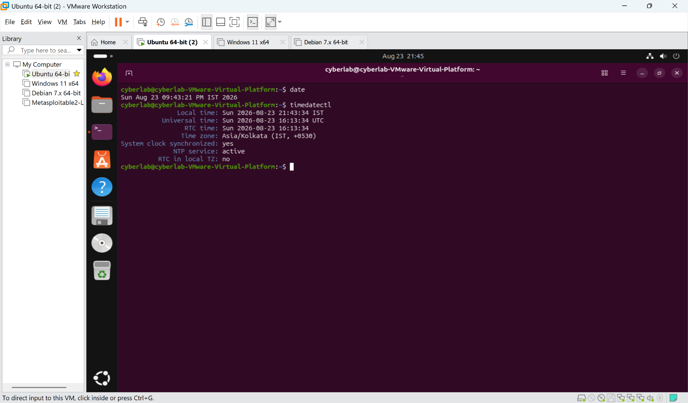
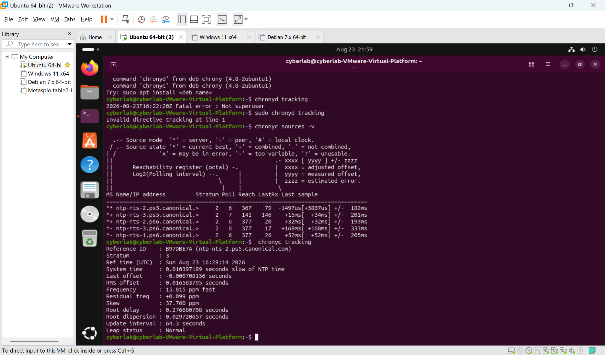
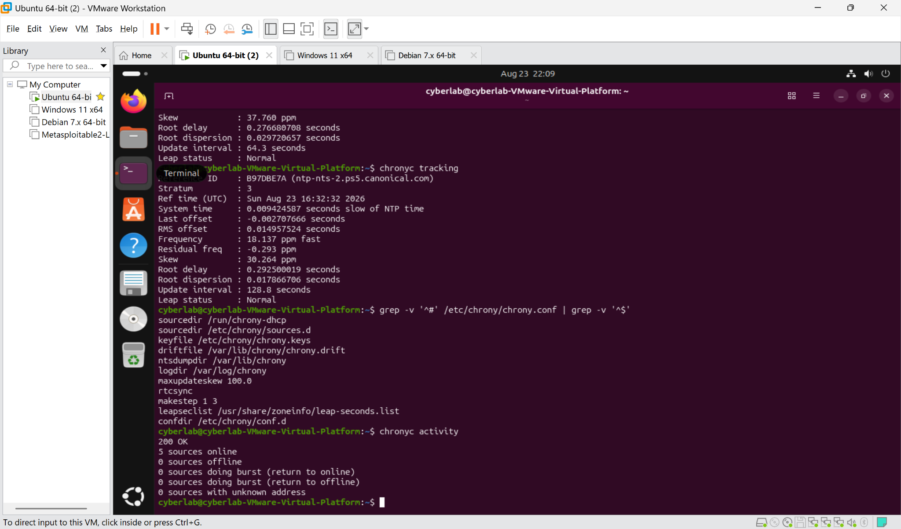
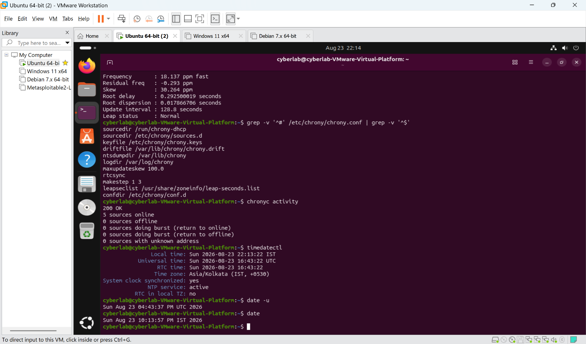
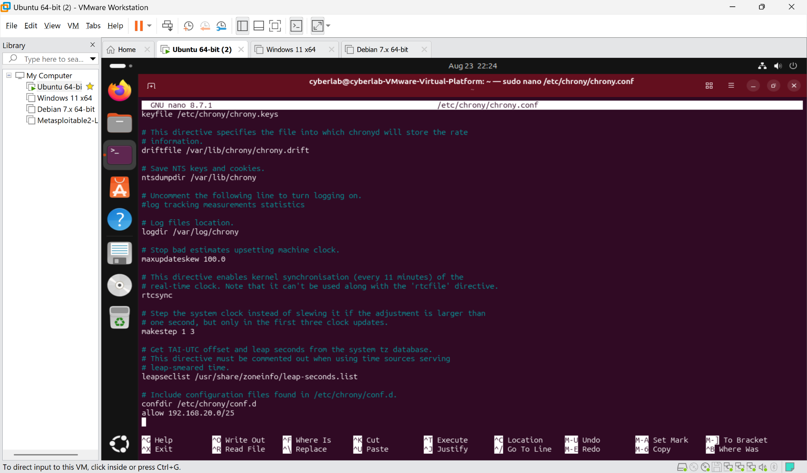
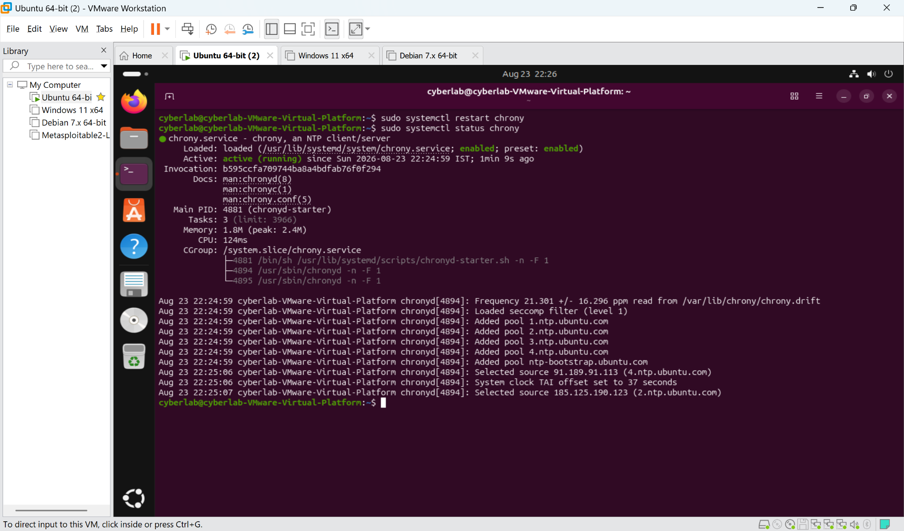
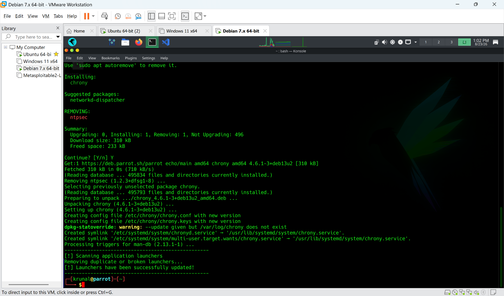
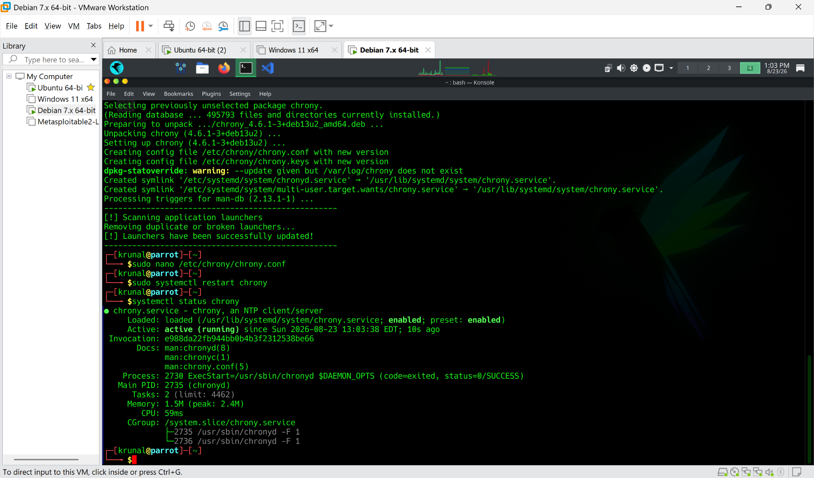
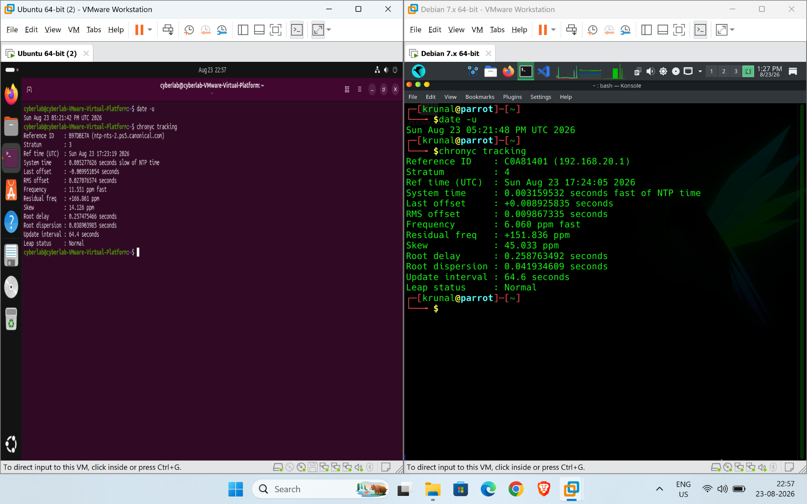
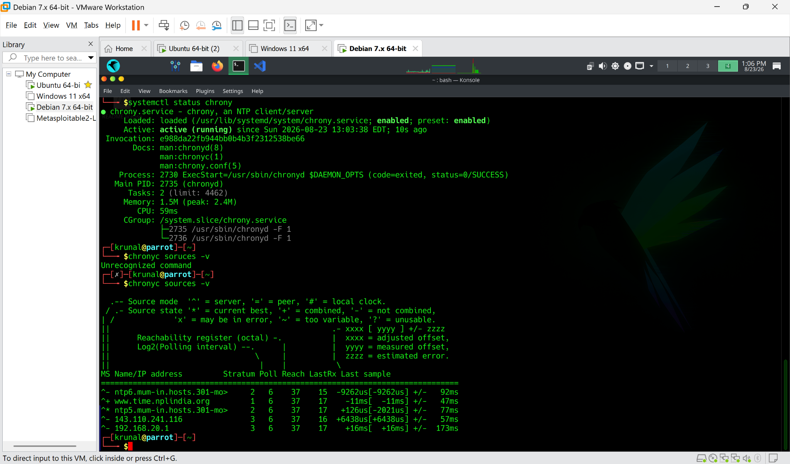

# Practical Lab Report – NTP Time Synchronization and Centralized Time Source

## Student Information

| Field | Details |
|---|---|
| Student | Krunal Patel |
| Lab | NTP / Time Synchronization |
| Date | 23 August 2026 |
| Platform | VMware Workstation |
| Network | 192.168.20.0/25 |

---

## 1. Objective

The objective of this practical was to understand how Network Time Protocol (NTP) synchronization works in a Linux environment and to configure an internal Ubuntu machine as an NTP server for another virtual machine.

The lab demonstrates:

- Checking the current system time and synchronization status.
- Understanding UTC and local time (IST/EDT).
- Inspecting Chrony NTP sources and tracking information.
- Configuring Ubuntu to allow NTP clients from the internal network.
- Verifying that Chrony listens on UDP port 123.
- Configuring a Parrot/Debian client to use the Ubuntu machine as its NTP source.
- Verifying successful synchronization between the virtual machines.
- Understanding why accurate time is important for security logs and SOC investigations.

---

## 2. Lab Environment

| Machine | Operating System | Role | Network |
|---|---|---|---|
| VM 1 | Ubuntu | Internal NTP Server | 192.168.20.0/25 |
| VM 2 | Parrot/Debian | NTP Client | 192.168.20.0/25 |
| Hypervisor | VMware Workstation | Virtualization platform | Internal VM network |

### NTP Architecture

```text
             External Trusted NTP Sources
                       |
                       v
              Ubuntu NTP Server
                192.168.20.1
                       |
                UDP/123 NTP
                       |
                       v
              Parrot/Debian Client
                 192.168.20.0/25
```

In this lab, Ubuntu obtains accurate time from trusted upstream NTP sources and then provides time synchronization to the client VM.

---

## 3. Tools Used

- Ubuntu Linux
- Parrot/Debian Linux
- Chrony
- `chronyc`
- `timedatectl`
- `date`
- `ss`
- `grep`
- VMware Workstation

---

# Task 1 – Check Initial Time Synchronization on Ubuntu

## Purpose

Before configuring the internal NTP server, the current time and synchronization status were checked.

### Commands

```bash
date
timedatectl
```

### Explanation

The `date` command displays the current local system time.

The `timedatectl` command provides detailed information including:

- Local time
- Universal Coordinated Time (UTC)
- RTC time
- Time zone
- Whether the system clock is synchronized
- Whether an NTP service is active

Ubuntu was configured with the `Asia/Kolkata` time zone, so its local time is displayed in IST. The same underlying system time can be represented as UTC.

### Screenshot Evidence



### Result

The Ubuntu system was already synchronized with an NTP source and its NTP service was active.

---

# Task 2 – Inspect Ubuntu NTP Sources and Tracking

## Purpose

Chrony was used to identify the NTP servers currently providing time to Ubuntu.

### Commands

```bash
chronyc sources -v
chronyc tracking
```

### Explanation

`chronyc sources -v` displays the configured NTP sources and their current status.

Important symbols include:

- `^` – server source
- `*` – current best source
- `+` – combined source
- `-` – source not currently combined
- `?` – unusable source

`chronyc tracking` provides detailed synchronization information such as:

- Reference ID
- Stratum
- System time offset
- RMS offset
- Frequency
- Root delay
- Root dispersion
- Leap status

### Screenshot Evidence



### Result

Ubuntu was successfully synchronized with upstream NTP servers and Chrony identified a current reference source.

---

# Task 3 – Check Chrony Activity and Configuration

## Purpose

The Chrony configuration and source activity were inspected before turning Ubuntu into an internal NTP server.

### Commands

```bash
chronyc activity
grep -v '^#' /etc/chrony/chrony.conf | grep -v '^$'
```

### Explanation

`chronyc activity` reports how many NTP sources are online, offline, or unavailable.

The configuration filtering command removes:

- Commented lines beginning with `#`
- Empty lines

This makes the active Chrony configuration easier to review.

### Screenshot Evidence



### Result

The system had active NTP sources and a functioning Chrony configuration.

---

# Task 4 – Verify UTC and Local Time

## Purpose

Time zones were examined to understand the difference between the system's local display time and UTC.

### Commands

```bash
timedatectl
date -u
date
```

### Explanation

NTP synchronizes the system clock to a common time reference. The local time zone is only a presentation setting.

For example:

```text
UTC  ->  common reference time
IST  ->  UTC + 05:30
```

Therefore, two machines can display different local times while still having the same synchronized UTC time.

This is important in security operations because logs from different systems may be normalized to UTC or converted by the SIEM into a common timeline.

### Screenshot Evidence



### Result

UTC and local IST time were successfully verified on Ubuntu.

---

# Task 5 – Configure Ubuntu as an Internal NTP Server

## Purpose

Ubuntu was configured to accept NTP requests from the internal virtual-machine network.

### Configuration

The Chrony configuration file was edited:

```bash
sudo nano /etc/chrony/chrony.conf
```

The following directive was added:

```text
allow 192.168.20.0/25
```

### Explanation

The `allow` directive permits NTP clients from the specified network to synchronize with this Chrony server.

The configured network is:

```text
192.168.20.0/25
```

The server used in this lab is:

```text
192.168.20.1
```

This creates the following relationship:

```text
Ubuntu
192.168.20.1
NTP Server
     |
     | UDP 123
     v
Parrot/Debian
192.168.20.0/25
NTP Client
```

### Screenshot Evidence



### Result

Ubuntu was configured to permit NTP clients from the internal `/25` network.

---

# Task 6 – Restart and Verify the Chrony Service

## Purpose

After changing the configuration, Chrony was restarted and its service status was verified.

### Commands

```bash
sudo systemctl restart chrony
sudo systemctl status chrony
```

### Explanation

Restarting Chrony loads the updated configuration.

The service status was checked to confirm that:

```text
Active: active (running)
```

This indicates that the Chrony daemon is running successfully.

### Screenshot Evidence



### Result

Chrony restarted successfully and was running as an NTP client/server service.

---

# Task 7 – Verify UDP Port 123

## Purpose

NTP uses UDP port 123. The listening socket was verified on Ubuntu.

### Command

```bash
sudo ss -lunp | grep ':123'
```

### Explanation

The command checks UDP listening sockets and identifies the process using port 123.

The output showed:

```text
0.0.0.0:123
users:(("chronyd", ...))
```

This confirms that Chrony was listening for NTP requests on UDP port 123.

### Evidence

The UDP/123 listener is also visible in the Chrony service verification sequence.

### Result

Ubuntu was listening for NTP traffic on UDP port 123.

---

# Task 8 – Install and Start Chrony on the Client VM

## Purpose

The client VM was prepared to use Chrony for NTP synchronization.

### Command

```bash
sudo apt install chrony
```

### Explanation

Chrony was installed on the Parrot/Debian client VM. Chrony provides the NTP client functionality required to synchronize the client clock with the Ubuntu NTP server.

### Screenshot Evidence



### Result

Chrony was successfully installed on the client VM.

---

# Task 9 – Configure and Verify the Client Against Ubuntu

## Purpose

The client was configured to use Ubuntu at `192.168.20.1` as its NTP source.

### Configuration

The client's Chrony configuration was updated to use:

```text
server 192.168.20.1 iburst
```

The service was then restarted:

```bash
sudo systemctl restart chrony
systemctl status chrony
```

The configured sources were checked with:

```bash
chronyc sources -v
```

### Explanation

The `server` directive tells Chrony which NTP server should provide time.

The `iburst` option allows Chrony to make a short series of measurements when the source becomes available, helping the client synchronize more quickly.

### Screenshot Evidence



### Result

The client was configured to communicate with the Ubuntu NTP server.

---

# Task 10 – Verify Successful Synchronization with Ubuntu

## Purpose

The final step was to confirm that the client was actually synchronized with the internal Ubuntu NTP server.

### Commands

```bash
sudo chronyc burst 4/4
chronyc sources -v
chronyc tracking
date -u
```

### Important Output

The client showed:

```text
Reference ID : 192.168.20.1
```

and:

```text
Leap status : Normal
```

The source list also showed:

```text
192.168.20.1
```

as the active NTP source.

### Explanation

The most important evidence is that the client identifies:

```text
192.168.20.1
```

as its reference NTP server.

This confirms the intended synchronization path:

```text
Trusted upstream NTP
        |
        v
Ubuntu 192.168.20.1
        |
        | NTP / UDP 123
        v
Parrot/Debian Client
```

The final screenshot also shows the Ubuntu and Parrot/Debian systems together, demonstrating that both systems are operating with synchronized time references.

### Screenshot Evidence



### Additional Client Verification



### Result

The client successfully synchronized with the Ubuntu internal NTP server.

---

# 4. Verification Summary

| Verification | Result |
|---|---|
| Ubuntu NTP synchronization | Successful |
| Ubuntu Chrony service | Active |
| Ubuntu UDP/123 listener | Confirmed |
| Internal network allowed | `192.168.20.0/25` |
| Ubuntu NTP server | `192.168.20.1` |
| Client Chrony service | Active |
| Client NTP source | `192.168.20.1` |
| Client reference ID | `192.168.20.1` |
| Leap status | Normal |
| Final synchronization | Successful |

---

# 5. Security and SOC Relevance

Accurate time synchronization is extremely important in cybersecurity operations.

A SOC may receive logs from:

- Firewalls
- Linux servers
- Windows systems
- Active Directory
- IDS/IPS
- EDR systems
- Web servers
- Authentication systems
- Applications
- Network devices

If these systems have significantly different clocks, an analyst may see events in the wrong order.

For example:

```text
10:00:01  Firewall: connection accepted
09:59:55  Server: login successful
10:00:08  EDR: suspicious process detected
```

Without reliable time synchronization, determining the actual attack sequence becomes difficult.

With synchronized clocks:

```text
10:00:01  Firewall: connection accepted
10:00:03  Server: login successful
10:00:08  EDR: suspicious process detected
10:00:12  File accessed
```

The SOC can construct a much more reliable incident timeline.

---

# 6. Why Internal NTP Servers Are Used in Enterprises

Small networks can often synchronize directly with trusted public NTP sources.

Large or highly controlled environments commonly use an internal NTP hierarchy.

```text
          Trusted External Sources
                    |
             +------+------+
             |             |
          NTP-01         NTP-02
             |             |
             +------+------+
                    |
             Internal Network
          +---------+---------+
          |         |         |
       Servers   Firewalls   Clients
          |
         SIEM
```

Advantages include:

1. Centralized time management.
2. Reduced dependence on external network connectivity.
3. Better control over trusted time sources.
4. Redundancy through multiple internal NTP servers.
5. Easier monitoring and auditing.
6. Consistent timestamps for security investigations.
7. Support for isolated or restricted networks.

In highly sensitive environments such as banking, government, defense, and critical infrastructure, internal time infrastructure can be especially important because systems may have strict network-access restrictions.

---

# 7. NTP Security Considerations

If time synchronization is ignored or poorly controlled, several security and operational problems can occur.

### 7.1 Incorrect Event Timeline

Attack events may appear out of order in logs.

### 7.2 Authentication Problems

Some authentication systems depend on timestamps and can reject requests when clock differences become excessive.

### 7.3 Difficult Incident Investigation

SOC analysts may not be able to accurately correlate events from different machines.

### 7.4 Log Correlation Problems

A SIEM depends heavily on reliable timestamps when combining events from multiple sources.

### 7.5 Time Manipulation

If an attacker can influence a system's time source, timestamps may become misleading and investigation can become more difficult.

Therefore, NTP should be treated as part of the organization's security infrastructure rather than simply a convenience for displaying the correct clock.

---

# 8. Key Concepts Learned

### NTP

Network Time Protocol synchronizes computer clocks over a network.

### Chrony

Chrony is a modern NTP implementation commonly used on Linux systems.

### UTC

UTC provides a common global time reference.

### Time Zone

A time zone changes how the same underlying time is displayed locally.

For example:

```text
UTC 16:00
IST 21:30
```

These represent the same instant.

### Stratum

Stratum represents the distance from a reference clock in the NTP hierarchy. Lower stratum generally indicates a source closer to the reference time source.

### UDP 123

NTP normally communicates using UDP port 123.

### `chronyc tracking`

Displays detailed synchronization information.

### `chronyc sources -v`

Displays configured NTP sources and their current state.

### `timedatectl`

Displays system time, time zone, RTC and synchronization status.

---

# 9. Final Outcome

The practical successfully demonstrated centralized time synchronization between two Linux virtual machines.

The Ubuntu VM was configured as an internal NTP server at:

```text
192.168.20.1
```

The client VM was configured to synchronize with Ubuntu over the internal:

```text
192.168.20.0/25
```

The final `chronyc tracking` output on the client identified:

```text
Reference ID : 192.168.20.1
```

with:

```text
Leap status : Normal
```

This confirms that the client was successfully synchronized with the internal Ubuntu NTP server.

---

# 10. Conclusion

This practical demonstrated how to deploy Chrony as an internal NTP service and synchronize another Linux machine against it.

The lab also demonstrated an important SOC concept: **accurate and consistent timestamps are essential for reliable security monitoring, event correlation, and incident response.**

In a production environment, multiple trusted internal NTP servers would normally be used for redundancy, while clients and security infrastructure would synchronize against the organization's approved time hierarchy.

