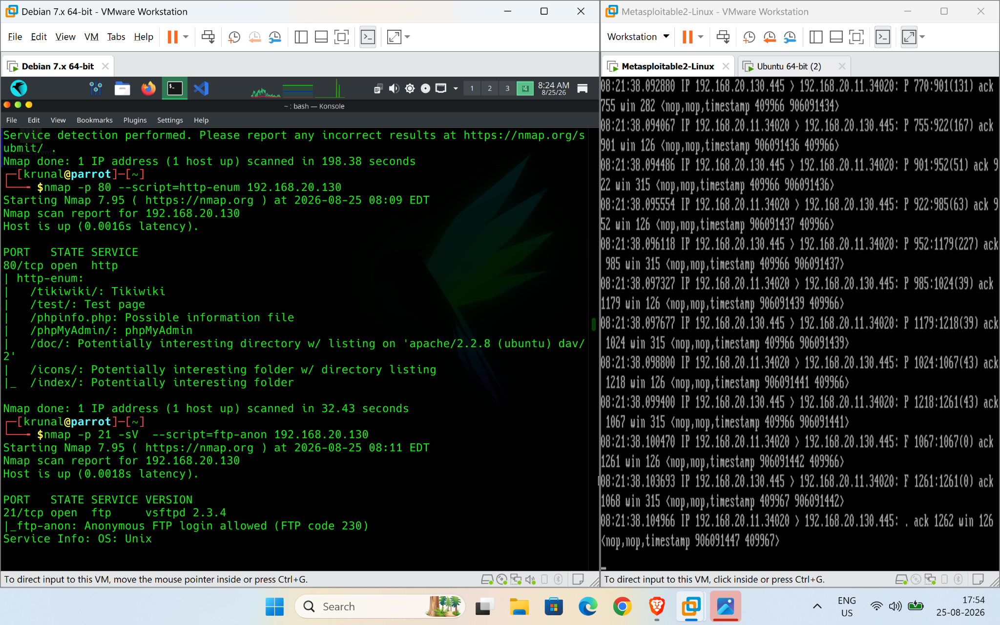
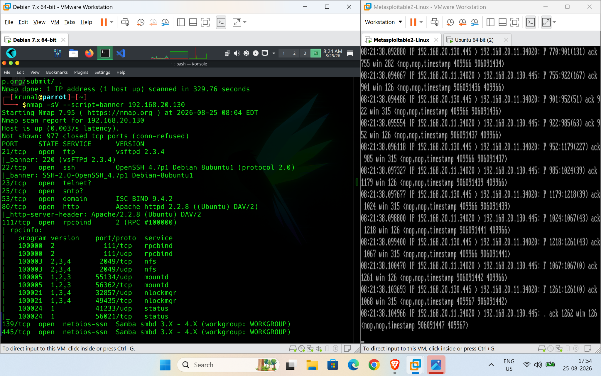
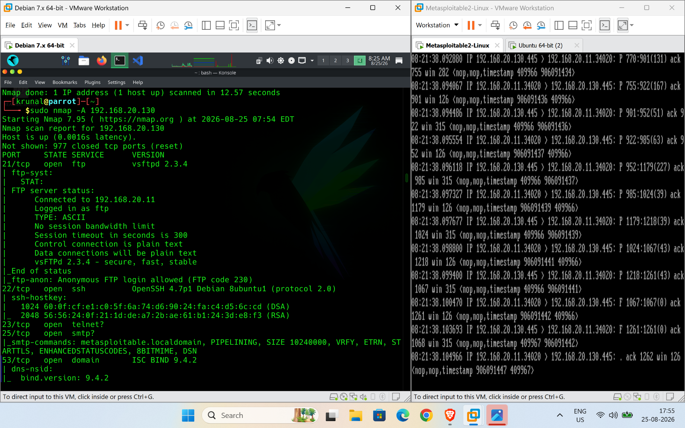
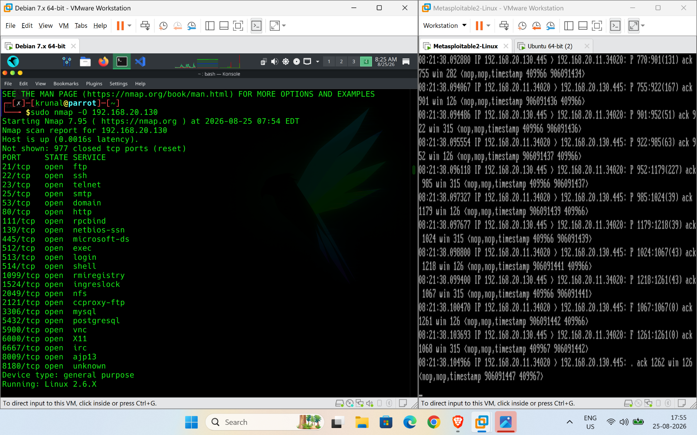
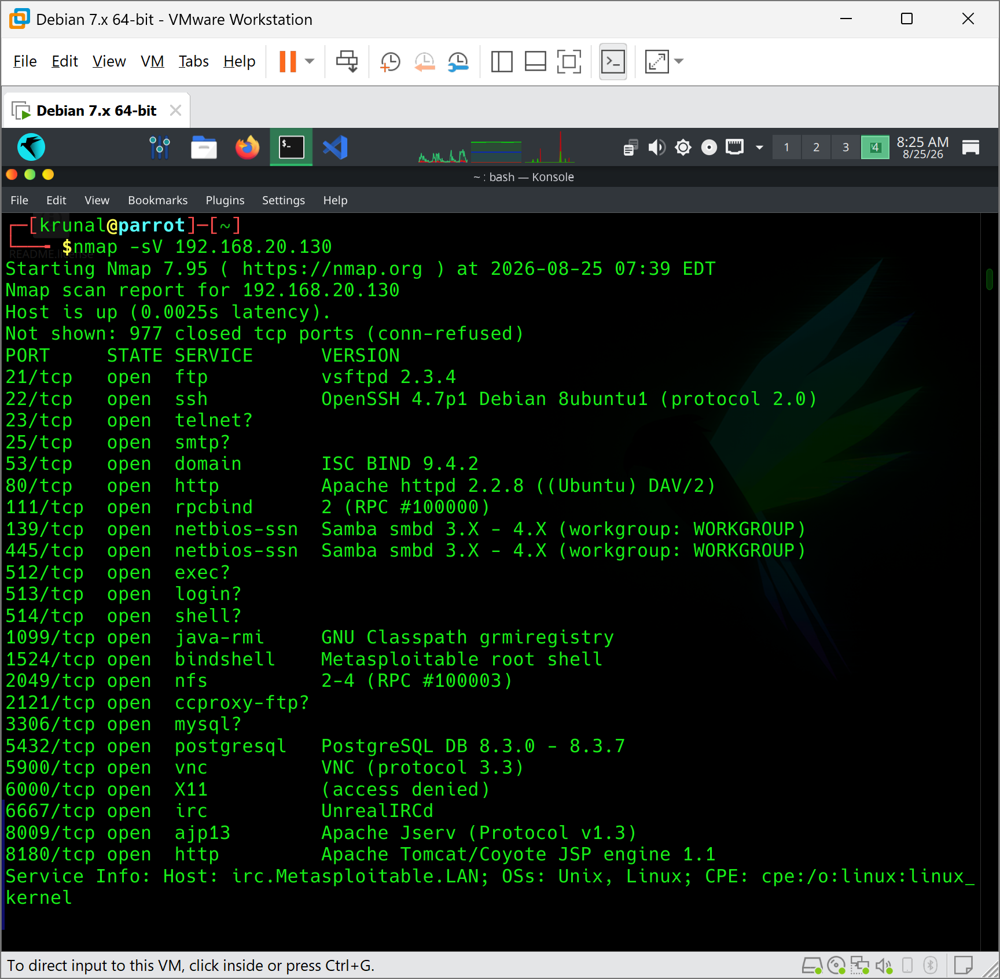
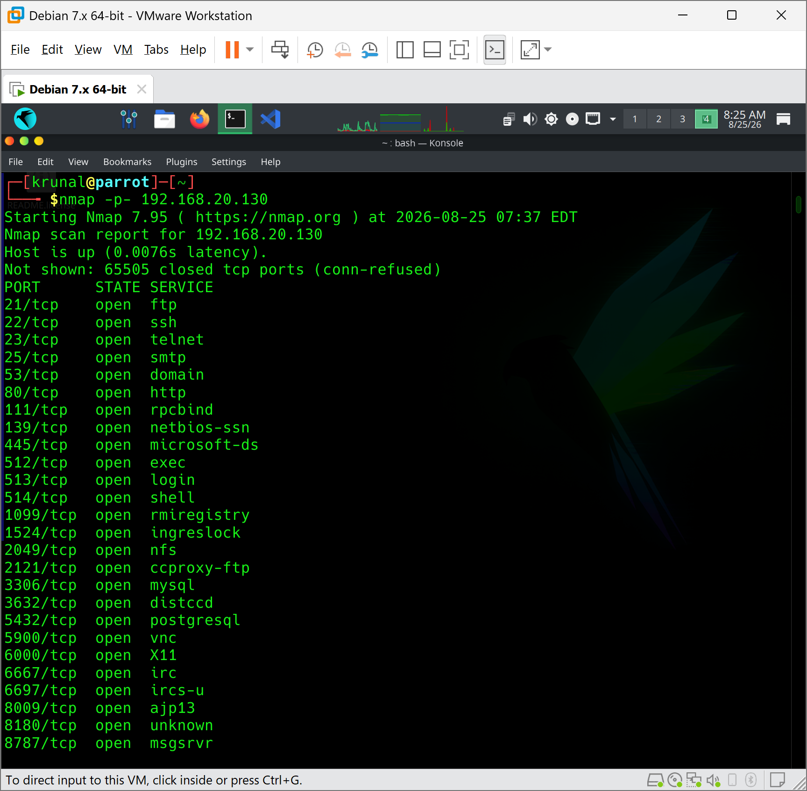
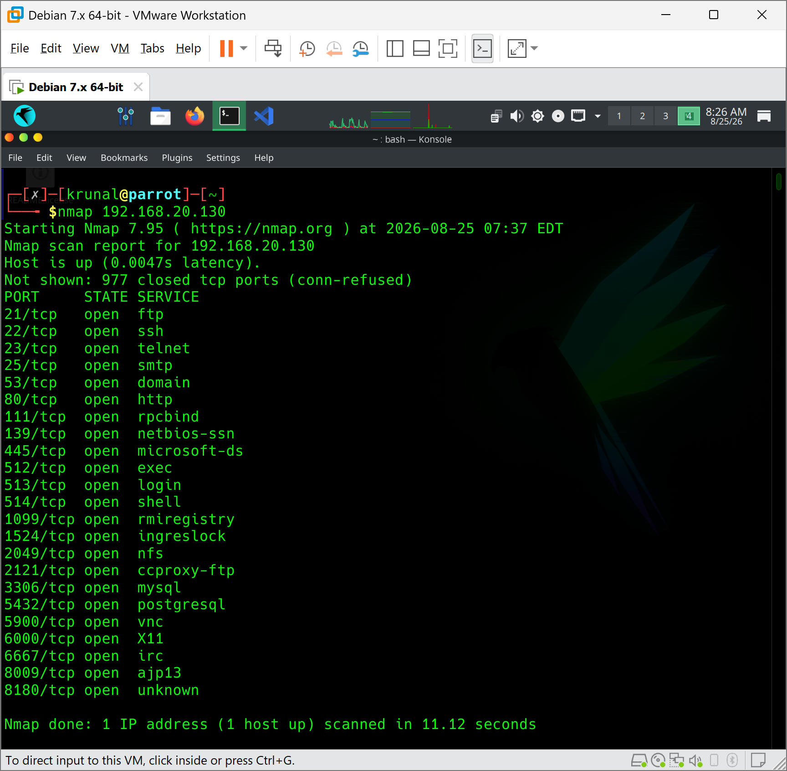
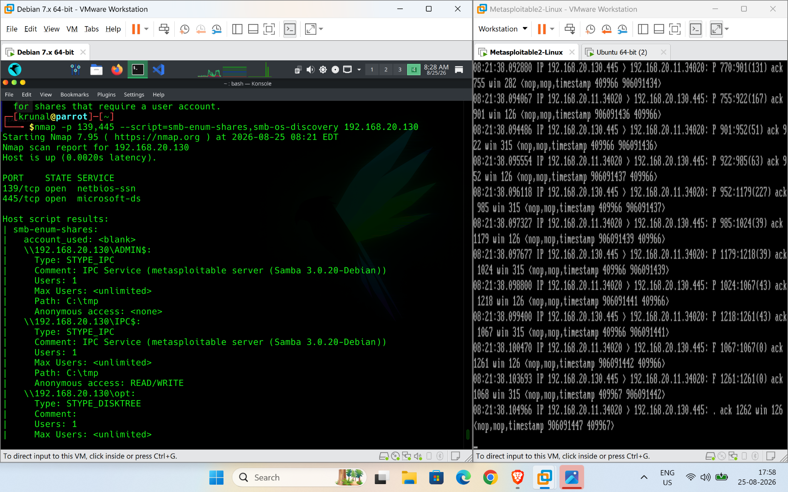
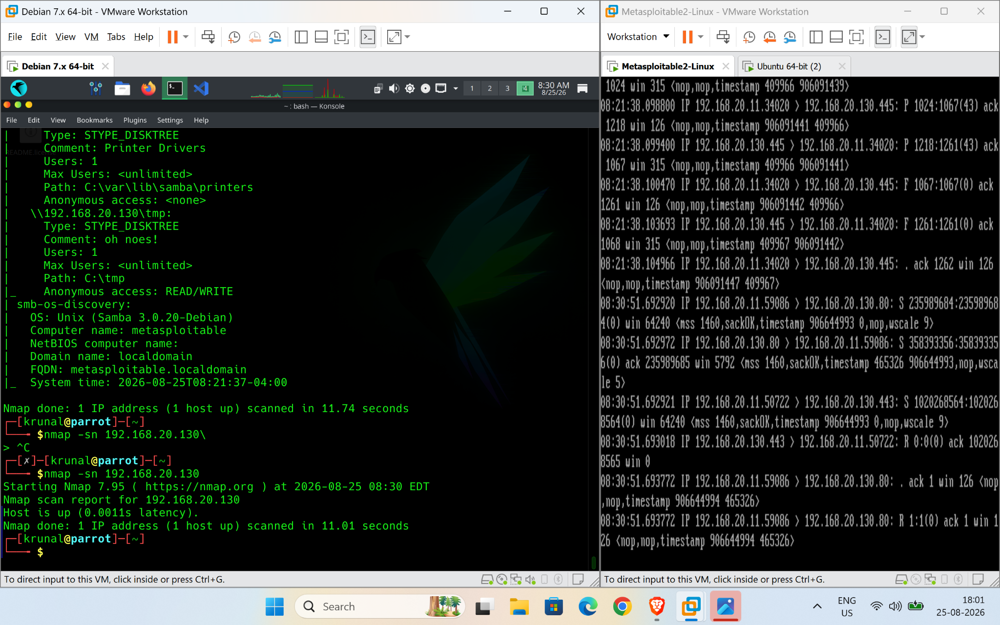
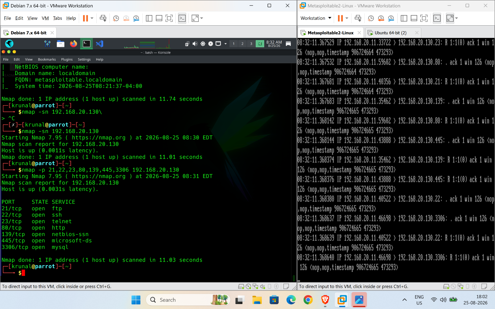

# Lab: Nmap Scanning and Service Enumeration Against Metasploitable 2

## Objective

The objective of this lab was to perform network reconnaissance against Metasploitable 2 using Nmap from Parrot OS. The lab covered host discovery, TCP port scanning, service/version detection, OS detection, NSE-based service enumeration, and observation of Nmap traffic on the target.

## Lab Environment

| System | Role | IP Address |
|---|---|---|
| Parrot OS | Nmap scanning system | 192.168.20.11 |
| Metasploitable 2 | Target system | 192.168.20.130 |

The systems were connected through the same isolated VMware virtual network.

## Tools Used

- Nmap 7.95
- Parrot OS
- Metasploitable 2
- tcpdump
- VMware Workstation

## Procedure

### 1. Basic Nmap Scan

Command:

```bash
nmap 192.168.20.130
```

The scan identified multiple open TCP services, including FTP, SSH, Telnet, SMTP, DNS, HTTP, SMB, MySQL, PostgreSQL, VNC, IRC, and other services.



### 2. Full TCP Port Scan

Command:

```bash
nmap -p- 192.168.20.130
```

The `-p-` option scans all TCP ports from 1 through 65535. This revealed additional services that are not necessarily included in Nmap's default top-port scan.



### 3. Service and Version Detection

Command:

```bash
nmap -sV 192.168.20.130
```

The `-sV` option attempts to identify the services and their versions. Examples observed included:

- vsftpd 2.3.4 on TCP/21
- OpenSSH 4.7p1 on TCP/22
- Apache HTTP Server 2.2.8 on TCP/80
- Samba 3.X–4.X on TCP/139 and TCP/445
- PostgreSQL 8.3.x on TCP/5432
- Apache JServ on TCP/8009
- Apache Tomcat/Coyote on TCP/8180



### 4. Aggressive Scan

Command:

```bash
sudo nmap -A 192.168.20.130
```

The aggressive scan combined several enumeration techniques, including service/version detection, OS detection, NSE scripts, and traceroute-related information.

The scan identified the target as a Linux system and exposed a large number of services.



### 5. HTTP Enumeration

Command:

```bash
nmap -p 80 --script=http-enum 192.168.20.130
```

The HTTP enumeration identified several interesting web resources, including:

- `/tikiwiki/`
- `/test/`
- `/phpinfo.php`
- `/phpMyAdmin/`
- `/doc/`
- `/icons/`
- `/index/`

This demonstrates how Nmap can move beyond simple port discovery and perform service-specific enumeration.



### 6. FTP Enumeration

Command:

```bash
sudo nmap -p 21 --script=ftp-anon 192.168.20.130
```

The result showed:

```text
Anonymous FTP login allowed (FTP code 230)
```

This is an important security finding because anonymous access can expose files or functionality without normal user authentication.



### 7. Banner and Service Enumeration

Command:

```bash
nmap -sV --script=banner 192.168.20.130
```

The scan retrieved service banners and additional service information. This illustrates why version and banner enumeration are useful during reconnaissance: an open port alone provides limited information, while a service/version can help identify outdated or vulnerable software.



### 8. SMB Enumeration

Command:

```bash
nmap -p 139,445 --script=smb-enum-shares,smb-os-discovery 192.168.20.130
```

The SMB scripts successfully enumerated shares and system information. The output showed Samba 3.0.20-Debian and revealed several shares, including `tmp`, with read/write access reported by the enumeration script.

The SMB OS discovery also identified:

- OS: Unix
- Computer name: metasploitable
- Domain: localdomain
- FQDN: metasploitable.localdomain



### 9. Host Discovery

Command:

```bash
nmap -sn 192.168.20.130
```

The `-sn` option performs host discovery without performing a normal port scan. The result confirmed that the target host was up.



### 10. Specific Port Scan

Command:

```bash
nmap -p 21,22,23,80,139,445,3306 192.168.20.130
```

This scan targeted a selected group of commonly interesting ports instead of scanning all ports. The result showed that FTP, SSH, Telnet, HTTP, SMB, and MySQL were open.



## Packet-Level Observation

During the scans, tcpdump was running on Metasploitable 2 to observe packets generated by Nmap.

The captured traffic showed TCP packets arriving from the Parrot OS system, including SYN packets and responses such as ACK and RST. This demonstrates that Nmap scanning is visible at the network layer and can be detected by network monitoring tools.

Example traffic pattern:

```text
Parrot OS                  Metasploitable 2
    |                            |
    | -------- TCP SYN --------> |
    | <------- SYN/ACK --------- |  Open port
    | <---------- RST ---------- |  Closed port
```

The packet captures also demonstrated that a network defender can observe scanning activity from the target side.

## Key Findings

| Observation | Security Relevance |
|---|---|
| Many TCP ports were open | Large attack surface |
| FTP anonymous access enabled | Unauthenticated access risk |
| Old service versions exposed | Potential vulnerability exposure |
| HTTP directories/resources discovered | Information disclosure risk |
| SMB shares were enumerable | Potential unauthorized data access |
| System and service banners were visible | Useful reconnaissance information |
| Nmap traffic was visible in tcpdump | Scanning can be detected and monitored |

## What I Learned

This lab demonstrated the progression from basic network discovery to detailed service enumeration:

```text
Host Discovery
      ↓
Port Scanning
      ↓
Service Detection
      ↓
Version Detection
      ↓
OS Detection
      ↓
NSE Enumeration
      ↓
Potential Security Findings
```

Nmap is therefore not only a port scanner. It can be used to identify exposed services, software versions, operating-system information, web resources, SMB information, and other details that are useful during security assessments.

The lab also demonstrated that scanning activity generates observable network traffic. Monitoring tools such as tcpdump can therefore be used to inspect and potentially detect reconnaissance activity.

## Conclusion

The Nmap scanning and service enumeration lab was successfully completed against Metasploitable 2. Multiple open services and service versions were identified, and targeted NSE scripts provided additional information about FTP, HTTP, and SMB. The results demonstrate how reconnaissance can reveal an application's attack surface before any exploitation is attempted.

This lab was performed against an intentionally vulnerable Metasploitable 2 virtual machine in an isolated lab environment.
